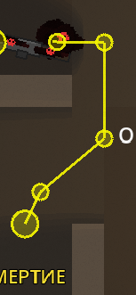
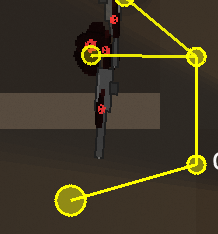
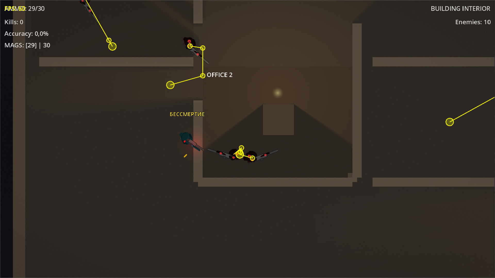

# Issue 1357 Case Study: Enemy Path Following Stalls At Wall Corners

Issue: https://github.com/Jhon-Crow/godot-topdown-MVP/issues/1357

Current PR: https://github.com/Jhon-Crow/godot-topdown-MVP/pull/1857

## Summary

The reported bug is not about ordinary patrol routes. The screenshots show a visible planned enemy path, but the enemy stalls at a wall/corner while trying to follow that path. Owner feedback also says the player no longer loses speed against walls, and suggests changing enemy-wall interaction by analogy with the player.

The root cause is in the enemy movement layer after NavigationAgent2D has already produced a valid next path point. Enemy navigation direction was modified by raycast wall avoidance and by a normal-based "corner escape" push. At the failing corner, that can pull the enemy away from the planned path or remove the tangential part of the motion. The player already solved the same class of wall-speed problem by projecting the intended direction along slide collision normals and normalizing it.

The implemented fix mirrors that player-side behavior inside enemy path movement:

- keep the NavigationAgent2D direction as the source of truth;
- allow wall avoidance only when it remains reasonably aligned with the path;
- project the enemy direction along real slide-collision normals instead of adding an escape normal away from the path;
- use the same projection for the speculative collision probe when the enemy is nearly stopped.

## Collected Data

Raw GitHub data is preserved under `data/`:

- `issue-1357.json`, `issue-1357-comments.json`, `issue-1357-timeline.json`
- related PR metadata, diffs, issue comments, review comments, and reviews for PRs 1358, 1396, 1477, 1483, and 1857
- `related-prs.json`

Owner logs are preserved under `logs/`. The most relevant files are:

- `game_log_20260324_200456.txt`
- `game_log_20260324_200849.txt`
- `game_log_20260325_064110.txt`
- `game_log_20260325_171900.txt`
- PR 1477 follow-up logs from March 25 and March 26, including broken-binary reports

Screenshots are preserved under `images/`:

- `issue-wall-stuck.png`
- `pr-1483-turn-still-stuck.png`
- PR 1477 follow-up screenshots showing the same corner/corridor behavior

Original issue screenshot:

PR 1483 owner feedback screenshot:

PR 1477 owner feedback screenshot:

## Timeline

2026-03-23, PR 1358:

- Attempted to solve this through patrol/navmesh point validation and path display changes.
- Owner replied that path display was broken and the issue was not patrol.
- Log `game_log_20260323_140633.txt` shows patrol points being removed as unreachable at large distances, matching the owner report that the AI was damaged by this approach.

2026-03-24, issue comment:

- Owner said the previous PR fully broke AI and asked to try again.

2026-03-24, PR 1396:

- Minimal change tried to keep wall avoidance from fully reversing navigation direction.
- This was directionally closer, but it only guarded one extreme case: avoidance more than 90 degrees away from the navigation direction.

2026-03-24 to 2026-03-25, PR 1483:

- Changed enemy scene collision masks and added delayed corner escape logic after stuck detection.
- Owner replied that the same problem persisted and linked PR 1477 as related.
- `game_log_20260325_064110.txt` shows a valid BuildingLevel navmesh bake with `poly_count=97` at line 484 and repeated corner checks beginning at line 553.
- `game_log_20260325_171900.txt` again shows `poly_count=97` at line 463, then repeated searching/pursuing corner checks from line 510 onward.

2026-03-25 to 2026-03-26, PR 1477 related evidence:

- Owner reported the enemy was stuck in the same place, and later that the corner was passed only when another enemy pushed it.
- Several logs show experimental `Global stuck max time: 20.0s`, so delayed stuck recovery can look broken during normal play.
- Later March 26 logs show a separate broken-binary symptom: `has_died_signal=false` and `Enemy tracking complete: 0 enemies registered`. Those are useful history, but they are not the root of issue 1357's path/corner movement.

2026-04-11, issue comment:

- Owner requested updating from main, collecting failed attempts, and using a new approach.
- The owner specifically suggested changing enemy-wall interaction by analogy with the player, because the player does not lose speed against walls.

## Evidence

The path exists:

- The screenshots show yellow path segments and waypoints around the failing wall turn.
- `game_log_20260325_064110.txt:484` and `game_log_20260325_171900.txt:463` show BuildingLevel navigation meshes baked successfully with nonzero polygon counts.
- Enemy path visualization is enabled in the key logs (`Enemy path visible: true` in experimental settings).

The failure is at the movement/collision layer:

- The enemy stalls at the physical wall/corner, while the planned path remains visible.
- Repeated corner-check logs appear while navigation and enemy tracking are otherwise alive.
- The owner's "can pass only if another enemy pushes it" observation points to contact physics/tangential velocity, not missing navigation data.

Prior fixes did not target the exact contact behavior:

- Patrol filtering treated the issue as invalid patrol points and broke unrelated behavior.
- Collision-mask changes and delayed escape impulses changed recovery behavior, but did not make the normal path-following velocity slide along walls.
- A simple "do not reverse direction" dot check did not address the smaller but still harmful case where avoidance and corner escape drain the useful tangent along the corridor.

## Online Research

Only primary Godot documentation was used for engine behavior:

- Godot 4.3 NavigationAgent2D docs say `get_next_path_position()` returns the next global position and must be used once every physics frame to update the agent's internal path logic: https://docs.godotengine.org/en/4.3/classes/class_navigationagent2d.html#get-next-path-position
- Godot 4.3 navigation-agent tutorial explains that `path_desired_distance`, `target_desired_distance`, and `path_max_distance` affect path following, and that the important updates are triggered by `get_next_path_position()` in `_physics_process()`: https://docs.godotengine.org/en/4.3/tutorials/navigation/navigation_using_navigationagents.html
- Godot 4.3 Vector2 docs define `slide(n)` as removing the projection along the normal, leaving the component perpendicular to that normal: https://docs.godotengine.org/en/4.3/classes/class_vector2.html#class-vector2-method-slide

This repository already follows that same Vector2.slide pattern in `scripts/characters/player.gd` for Issue 1769. The enemy fix reuses that existing local pattern instead of introducing a new pathing library or a second movement model.

## Root Cause

`scripts/objects/enemy.gd::_move_to_target_nav()` asks NavigationAgent2D for a next path direction, then modifies that direction before assigning velocity.

Before this fix, the post-navigation logic did two risky things:

1. `_apply_wall_avoidance()` could bend the path-following direction far away from the NavigationAgent direction.
2. The corner escape block summed slide collision normals and added an "escape" component to the movement direction. At the failing wall turn, that can push away from the planned path instead of preserving the corridor tangent.

The player uses a different model: when pushing into a wall, project the requested movement direction along the wall normal and normalize it. That keeps full-speed tangential motion without needing delayed stuck recovery.

## Implemented Solution

Changed `scripts/objects/enemy.gd::_move_to_target_nav()`:

- stores the raw `nav_direction`;
- computes the raycast avoidance direction;
- keeps the avoided direction only when `nav_direction.dot(avoided_direction) >= 0.5`;
- iterates previous slide-collision normals and applies `direction.slide(normal)` when the enemy is pushing into the wall;
- applies the same slide projection to the speculative collision probe used when velocity is nearly zero;
- removes the old escape-normal addition from this movement path.

This is intentionally narrow. It does not modify patrol point generation, enemy scene collision masks, global stuck timing, NavigationAgent parameters, or motion mode.

## Regression Coverage

Added `tests/unit/test_enemy_wall_slide_navigation.gd`:

- pure vector test proving wall projection preserves a normalized path tangent;
- pure vector test proving perpendicular avoidance is rejected while aligned avoidance is accepted;
- source-level guard test proving `_move_to_target_nav()` contains the Issue 1357 wall-slide projection and no longer contains the old escape-normal weight pattern.

## Alternatives Considered

Broaden the NavigationAgent path margins:

- Godot docs warn that too-low distances can create repath loops and too-high distances can skip points. The logs and screenshots do not show missing paths; they show contact failure at the wall, so this would be indirect and higher risk.

Keep collision-mask changes from PR 1483:

- Owner feedback after PR 1483 still reproduced the failure. Enemy-enemy interaction can contribute to crowding, but the single-enemy wall turn still needs tangential wall projection.

Use delayed stuck recovery:

- Logs show global stuck max time can be 20 seconds. A delayed rescue may eventually move the enemy, but the expected behavior is to follow the planned path through the turn without looking stuck.

Switch to a third-party steering/path library:

- Not needed. Godot's NavigationAgent2D and CharacterBody2D already provide the required pieces, and this repo already has the player-side wall-slide pattern.

## Verification Notes

Local Godot is not installed in this workspace, so the GUT suite cannot be run locally here. The new regression test is designed for the existing CI GUT workflow. Local verification performed in this workspace:

- `dotnet build` passed with 94 existing warnings and 0 errors; output saved to `logs/local-dotnet-build.log`.
- `wc -l scripts/objects/enemy.gd` reports exactly 5000 lines, which is at the architecture limit but not over it.
- Source checks confirm the old escape-normal pattern is gone and the new wall-slide projection is present.
- CI GUT and compile checks are still required to validate GDScript syntax and behavior with Godot.
