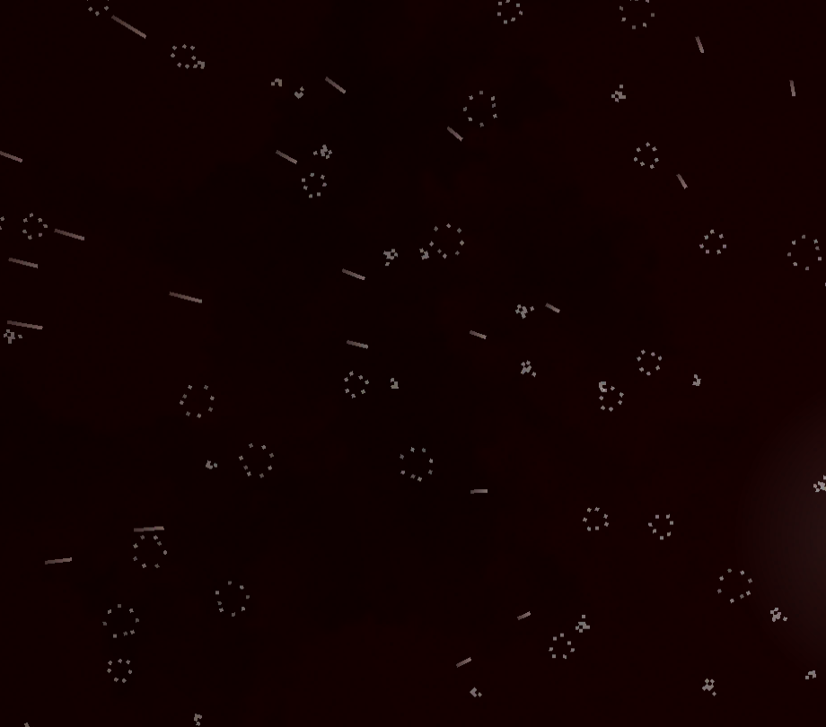

# Case Study: Top-Down Rain Precipitation Effect (Issue #1394)

## Problem Statement

The Docks level needed a weather precipitation system that:
1. Adds atmospheric top-down rain visual effect
2. Supports "rare rain" — intermittent episodes rather than constant rain
3. Excludes rain from indoor areas (WarehouseA, WarehouseB)
4. Is reusable for other maps and future precipitation types

## Root Cause Analysis

The project had no weather/precipitation system at all. The existing particle effects (`DustEffect`, `SparksEffect`, `BloodEffect`, etc.) were all one-shot effects triggered by gameplay events, not continuous environmental effects.

### Initial Implementation Issues (2026-03-24)

The first implementation was reported as "not visible" by the project owner (game log: `game_log_20260324_075210.txt`). Root cause analysis of the game log revealed:

1. **Rain started too late**: The initial delay was 30-90 seconds (`start_raining = false`, `min_interval = 30`). The user's game session lasted only ~47 seconds (07:52:23 to 07:53:10), so the first rain episode likely never triggered.
2. **Rain was too subtle**: Particle opacity was only 0.35 alpha, with small 2x12px texture and only 120 particles — very hard to notice against the game's detailed background.
3. **No logging**: The rain effect had zero log output, making it impossible to verify whether rain episodes started at all. The only log line was from `docks_level.gd` confirming setup: `"Rain precipitation setup with 2 exclusion zones"`.
4. **z_index too low**: Rain was at z_index=10, which might not render above all game elements.

### Fix Applied (Iteration 1: Visibility)

- Added `initial_delay` export (default 5s) — first rain episode starts much sooner
- Reduced interval between episodes: 15-45s (was 30-90s)
- Increased episode duration: 15-40s (was 10-30s)
- Increased particle count: 200 (was 120)
- Increased particle opacity: 0.5 alpha (was 0.35)
- Increased gradient peak opacity: 0.7 (was 0.5)
- Increased texture size: 3x16px (was 2x12px)
- Increased z_index to 100 (was 10) for reliable rendering above all game elements
- Added comprehensive logging to track rain episode lifecycle

### Perspective Issue (2026-03-24, game log: `game_log_20260324_090934.txt`)

After the visibility fix, the project owner reported two remaining issues:
1. Rain should start **immediately** — even a 5s delay was too long
2. Rain looked like **side-view** falling streaks, but the game is top-down — rain should appear as drops falling from above (onto the camera)

### Fix Applied (Iteration 2: Immediate Start + Top-Down Perspective)

- Changed `start_raining = true` with `initial_delay = 0` for immediate rain on level load
- Replaced side-view streak particles with top-down splash dots (circular ripples)
- Removed gravity and downward velocity — splashes appear in-place across viewport

### Hotline Miami 2 Reference Request (2026-03-24)

The project owner provided a reference screenshot from **Hotline Miami 2** (`hm2-rain-reference.png`) showing the desired rain style. Analysis of the HM2 rain reveals a **two-layer particle system**:

1. **Diagonal rain streaks**: Short white lines falling at ~30° angle (upper-left to lower-right). These represent raindrops in motion, rendered as thin elongated particles moving diagonally across the screen.
2. **Circular splash ripples**: Small ring-shaped dots scattered across the ground. These represent raindrops hitting the ground surface, rendered as short-lived radial gradient circles.

The combination creates a convincing top-down rain effect: you see both the falling drops (streaks) and their impact on the ground (splashes).

### Fix Applied (Iteration 3: Hotline Miami 2-Style Two-Layer Rain)

Completely restructured the rain effect from a single GPUParticles2D to a **Node2D with two child GPUParticles2D** nodes:

| Layer | Particles | Texture | Movement | Purpose |
|-------|-----------|---------|----------|---------|
| RainStreaks | 180 | 2×12px vertical line | Diagonal (350-500 px/s, ~30°) | Falling raindrops |
| RainSplashes | 100 | 6×6px radial circle | Near-zero (in-place) | Ground impact ripples |

Key parameters matching HM2 style:
- Streaks use a thin gradient line texture with alpha fade at both ends
- Streaks move diagonally (direction Vector3(0.5, 1.0, 0)) at high speed with tight spread (5°)
- Splashes use a radial gradient creating a ring/dot effect
- Splashes have very low velocity, appearing and fading in-place
- Both layers use cool blue-white tint (Color ~0.85-0.95 RGB) matching HM2's palette

### Splash Misalignment Issue (2026-03-24, Iteration 5)

After fixing rain to fall straight down (Iteration 4 changed direction from diagonal to vertical), the user reported that splashes still don't land where streaks fall. The screenshot showed two clearly separated particle areas — streaks in one region, splashes offset below.

**Root cause:** The `RainSplashes` node had `position = Vector2(0, 180)`, which was calculated for the old diagonal trajectory. Even after making rain vertical, the splash emission box was displaced 180px below the streak emission box. Since both boxes covered a 700×450 area, the two layers were visually disconnected.

**Fix:** Removed the position offset entirely — both `RainStreaks` and `RainSplashes` now emit from the exact same area (centered on camera). Since streaks fall downward through this area and splashes appear in-place within the same area, the visual result is that drops appear to land and splash within the same region. Both layers share matching visibility rects `Rect2(-900, -600, 1800, 1200)`.

| Parameter | Before | After |
|---|---|---|
| Splash position offset | `Vector2(0, 180)` | `Vector2(0, 0)` (no offset) |
| Splash visibility_rect | `Rect2(-800, -500, 1600, 1000)` | `Rect2(-900, -600, 1800, 1200)` (matches streaks) |

### Key Technical Challenges

1. **Large map coverage**: The Docks map is ~5000x4000 pixels, much larger than the viewport (1280x720). Rain must follow the camera.
2. **Building detection**: WarehouseA (500x600px at position 400,1800) and WarehouseB (700x840px at position 4400,2800) have roofs — rain should not appear when the camera is inside.
3. **Performance**: Continuous particle effects must be lightweight. GPUParticles2D processes particles on the GPU, so even 200 particles have minimal CPU impact.
4. **Intermittent rain**: "Rare rain" means rain episodes occur randomly, not constantly.
5. **Visibility**: Rain must be visible enough to be noticed but not so opaque as to obstruct gameplay.

## Solution

### Architecture

The solution consists of three parts:

1. **`scripts/effects/rain_effect.gd`** — Reusable rain controller script (extends Node2D)
   - Manages rain episodes with configurable timing (interval between episodes, duration)
   - Creates two child GPUParticles2D nodes programmatically (streaks + splashes)
   - Follows the active camera automatically
   - Supports rectangular exclusion zones for indoor areas
   - Toggles particle emission on both layers based on camera position relative to exclusion zones

2. **`scenes/effects/RainEffect.tscn`** — Reusable rain scene (Node2D)
   - Two-layer Hotline Miami 2-style rain:
     - **RainStreaks**: 180 vertical falling raindrop particles (2×12px gradient line, 400-500 px/s)
     - **RainSplashes**: 100 ground ripple particles (6×6px radial circle, near-zero velocity)
   - Both layers emit from the same overlapping area for unified drop-and-splash appearance

3. **Level integration** — DocksLevel.tscn includes the RainEffect scene, and docks_level.gd configures exclusion zones

### Exclusion Zone Approach

Rather than using collision-based detection (which would require physics setup), the solution uses simple Rect2 bounds checking. This is:
- **Fast**: A single `Rect2.has_point()` check per zone per frame
- **Simple**: No physics layers or collision shapes needed
- **Configurable**: Each level defines its own zones in its setup script

### Rain Episode Timing

For "rare rain" on the Docks:
- **Initial delay**: 5 seconds (so first rain appears quickly)
- **Interval between episodes**: 15-45 seconds (randomized)
- **Episode duration**: 15-40 seconds (randomized)
- All timing is configurable via exported properties

## Existing Solutions Considered

| Approach | Pros | Cons | Decision |
|----------|------|------|----------|
| GPUParticles2D (chosen) | GPU-accelerated, follows existing effect patterns, simple | Limited collision options | **Selected** — best fit for project patterns |
| CPUParticles2D | Can collide with physics bodies | CPU-bound, doesn't match existing codebase | Rejected |
| Shader-based rain | Pixel-perfect coverage, zero overdraw | Complex implementation, hard to configure per-zone | Rejected |
| Tilemap-based animation | Integrates with tile system | Project doesn't use tilemaps for weather | Rejected |

## File Changes

| File | Change Type | Description |
|------|------------|-------------|
| `scripts/effects/rain_effect.gd` | New | Rain controller with episodes and exclusion zones |
| `scenes/effects/RainEffect.tscn` | New | Rain GPUParticles2D scene |
| `scenes/levels/DocksLevel.tscn` | Modified | Added RainEffect instance to level |
| `scripts/levels/docks_level.gd` | Modified | Added `_setup_rain()` with WarehouseA/B exclusion zones |
| `tests/unit/test_rain_effect.gd` | New | 24 unit tests for rain logic |

## Testing

Unit tests cover:
- Initial state (not emitting, no active episode)
- Episode lifecycle (start, stop, scheduling)
- Timing ranges (interval and duration within configured bounds)
- Exclusion zone detection (add, clear, point-in-zone checks)
- Building enter/exit behavior (rain stops/resumes)
- Warehouse-specific zone coordinates
- Edge cases (starting inside building, boundary points)

## References

- [Godot GPUParticles2D documentation](https://docs.godotengine.org/en/4.3/classes/class_gpuparticles2d.html)
- [Dynamic Weather Systems in Godot (Wayline)](https://www.wayline.io/blog/dynamic-weather-systems-godot)
- [Particle Systems in Godot - Rain (Dante's Lab)](https://www.dlab.ninja/2024/12/particle-systems-in-godot-introduction.html)
- [2D Particle Systems tutorial (Godot docs)](https://docs.godotengine.org/en/stable/tutorials/2d/particle_systems_2d.html)

## Future Extensibility

The `RainEffect` scene and script are designed to be reusable:
- Any level can instance `RainEffect.tscn` and configure exclusion zones
- Different precipitation types (snow, hail) can be created by duplicating the scene with different particle materials
- The timing properties are all exported, so each level can have different weather patterns
- The `start_raining` flag allows levels to begin with rain already active
