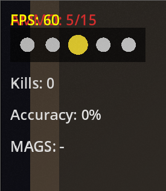

# Case Study: Issue #1485 — Old HUD Shown on Some Maps

## Summary

On certain maps (e.g. BuildingLevel / "Здание"), the HUD was still displaying the old
`Kills: 0` and `Accuracy: 0%` labels instead of the new `Difficulty:` label.

**Screenshot of the bug:**



The screenshot shows `Kills: 0`, `Accuracy: 0%`, and `MAGS: -` in the top-left corner
instead of `Difficulty: Hard` and `MAGS: -`.

---

## Timeline / Sequence of Events

1. **New HUD introduced**: GDScript level scripts (e.g. `building_level.gd`,
   `revolver_level.gd`, `docks_level.gd`, `factory_level.gd`, `city_level.gd`,
   `test_tier.gd`, `labyrinth_level.gd`, `labyrinth2_level.gd`, `arena_level.gd`)
   were updated to display a `DifficultyLabel` at offset `top=80` instead of the
   old `KillsLabel` + `AccuracyLabel` combo.

2. **LevelInitFallback not updated**: The C# fallback component
   `Scripts/Components/LevelInitFallback.cs` was NOT updated at the same time.
   It continued to create the old `KillsLabel` (top=80) and `AccuracyLabel`
   (top=115) in debug mode, and placed `MagazinesLabel` at top=150.

3. **Godot 4.3 binary tokenization bug** (`godotengine/godot#94150`): On some
   machines/configurations, the GDScript `_ready()` method fails to execute due
   to this engine bug. `LevelInitFallback.cs` detects this by checking whether
   `_enemies` array is populated or `_initial_enemy_count > 0`.

4. **Bug triggered**: When a user plays BuildingLevel (or any of the 6 affected
   levels) and their GDScript doesn't execute, `LevelInitFallback.cs` takes over
   and displays the old HUD layout.

---

## Root Cause Analysis

**Primary root cause**: `LevelInitFallback.cs`'s `SetupDebugUI()` method was not
updated when the GDScript level scripts were migrated from KillsLabel/AccuracyLabel
to DifficultyLabel.

**Contributing factor**: The Godot 4.3 engine bug causes GDScript `_ready()` to
silently fail on some machines, making the fallback path active for normal gameplay
sessions rather than just edge cases.

**Affected levels** (those using both LevelInitFallback AND the new DifficultyLabel
in their GDScript):
- `BuildingLevel` / `building_level.gd`
- `CityLevel` / `city_level.gd`
- `DocksLevel` / `docks_level.gd`
- `FactoryLevel` / `factory_level.gd`
- `RevolverLevel` / `revolver_level.gd`
- `TestTier` / `test_tier.gd`

Levels without LevelInitFallback (e.g. LabyrinthLevel, Labyrinth2Level, ArenaLevel)
were not affected since they always use their GDScript.

---

## Evidence from Game Log

From `game_log_20260325_044957.txt`:

```
[04:50:06] [INFO] [LevelInitFallback] GDScript _ready() did NOT execute - performing C# fallback initialization
```

This confirms the fallback ran for BuildingLevel. Consequently `SetupDebugUI()`
created the old KillsLabel + AccuracyLabel. The user had `Debug: true` in
ExperimentalSettings, which is why both old labels appeared (they were only created
in debug mode in the old code).

---

## Fix

**File changed**: `Scripts/Components/LevelInitFallback.cs`

**Changes**:
1. Replaced `_killsLabel` + `_accuracyLabel` fields with a single `_difficultyLabel` field.
2. Updated `SetupDebugUI()` to create a `DifficultyLabel` (always shown, matching GDScript),
   positioned at `top=80` (same as GDScript). Removed KillsLabel/AccuracyLabel creation.
3. Moved `MagazinesLabel` offset from `top=150` to `top=115` to match GDScript positioning.
4. Updated `UpdateDebugUI()` to refresh the DifficultyLabel text from DifficultyManager.
5. Updated `SyncGDScriptProperties()` to sync `_difficulty_label` instead of old labels.

---

## Verification

The fix ensures that when `LevelInitFallback.cs` performs fallback initialization,
the HUD it creates matches exactly what the GDScript would have created:
- `DifficultyLabel` at top=80 showing current difficulty name
- `MagazinesLabel` at top=115 showing magazine ammo counts

This matches the layout in all 6 affected level scripts.
