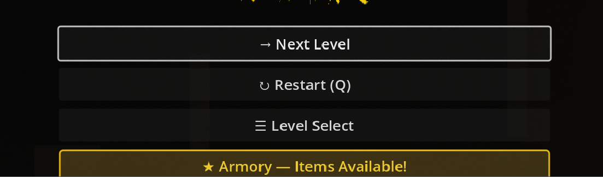
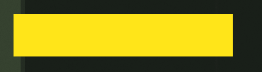
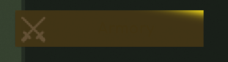
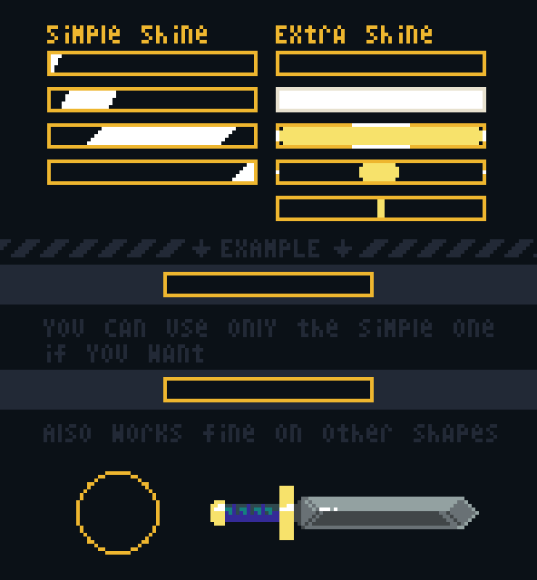

# Case Study: Issue #1536 — Gold Shine Animation for Armory UI

## Problem Statement

The armory tab and unlockable item cards in the armory menu needed an animated gold shine effect to indicate available unlocks. The original request asked for:
- A 4-frame diagonal sweep highlight
- Glowing border
- Gold background fill

## Iteration History

### Iteration 1 (initial)
- Added `gold_shine.gdshader`: 3-phase shader with diagonal sweep → bright yellow hold → fade
- Applied to armory slots in `armory_menu.gd` via `ColorRect` overlay
- Applied to armory button in `pause_menu.gd` via `ColorRect` overlay

### Feedback Round 1
Owner reported:
1. Armory button in pause menu only blinks (no gradient sweep)
2. Gradient direction should be top-right → bottom-left
3. After sweep, whole card should become bright yellow
4. Remove border animation

### Iteration 2 (fix per round 1 feedback)
- Fixed shader direction (top-right → bottom-left)
- Added bright yellow hold phase (phase 1, 40–70%)
- Removed border glow
- Applied same shader to pause menu armory button

### Feedback Round 2 (current)
Owner reported (with screenshots):
1. **Score screen icon not animated**: Armory button on score screen only shows a blink, no sweep animation
2. **Opaque yellow looks awful**: The solid bright yellow fill covers the card entirely, making it look garish — request: "gold flash from center" instead
3. **Icon dimmed**: The suitcase/case icon became visually dimmer due to the overlay layering
4. **"Armory" text invisible** in pause menu: text can't be read against the overlay

## Root Cause Analysis

### Problem 1: Score screen armory button not animated
- The score screen armory button is created dynamically in 13 level scripts and `LevelInitFallback.cs`
- None of these scripts applied the shader overlay — only `pause_menu.gd` and `armory_menu.gd` did
- **Fix**: Added `ArmoryGoldShineOverlay` ColorRect after `buttons_container.add_child(armory_button)` in all 14 files

### Problem 2: Opaque yellow covers icon and text
- The old shader used `mix(gold_base, gold_bright, bright_blend)` where `gold_bright` was full-opacity yellow
- During the hold phase (`bright_blend = 1.0`), COLOR became fully opaque bright yellow — covering everything underneath
- **Fix**: Switched to `render_mode blend_add` (additive blending). In additive mode:
  - Dark pixels (glow=0) add nothing — base colors unchanged
  - Bright pixels add a gold/yellow glow on top
  - Icons and text remain fully visible; they just get a golden shimmer
- Also changed animation from solid fill → **radial burst expanding from center** (expanding ring + fill)

### Problem 3: Icon dimmed by overlay
- In normal `mix` blend mode, even a semi-transparent overlay darkens/tints the content beneath
- With additive blend, the overlay only adds brightness — dark parts of overlay are invisible
- **Fix**: Same as Problem 2 — additive blend removes any dimming effect

### Problem 4: Text invisible in pause menu
- `pause_menu.gd` was overriding `font_color` to `Color(0.1, 0.08, 0.0, 1.0)` (near-black)
- The original intent was: dark text on bright-gold background
- But with the overlay approach, the base button background is dark (not gold) — so dark text on dark BG = invisible
- With additive blend the background stays dark, so text must be bright
- **Fix**: Changed `font_color` override to `Color(1.0, 0.85, 0.2, 1.0)` (bright gold) — always visible

## Solution Architecture

### Shader Design (`gold_shine.gdshader`)
```
render_mode blend_add;  // Additive blend: overlays only add brightness

Phase 0 (0–45%): Diagonal stripe sweeps top-right → bottom-left
  - Uses Gaussian falloff for a soft, narrow highlight stripe
  - Smooth fade in/out at phase edges

Phase 1 (45–65%): Radial burst from center
  - Expanding ring from center + inner fill
  - Ring expands to full card radius, then fades out
  - Creates "flash from center" effect as requested

Phase 2 (65–100%): Smooth fade to zero
  - Very dim residual glow during fade
  - Returns to baseline (black = no additive contribution)
```

### Why Additive Blending
Additive blending is the standard technique for:
- Magical/glowing effects in games (item pickups, skill highlights)
- Status indicators that must not obscure underlying content
- Shine animations on buttons without affecting readability

Reference: Unity/Godot best practices for UI glow effects consistently recommend additive blending for non-destructive overlays.

### Files Modified
- `scripts/shaders/gold_shine.gdshader` — shader redesign
- `scripts/ui/pause_menu.gd` — font color fix
- `scripts/ui/armory_menu.gd` — (no change needed; overlay logic already correct)
- `scripts/levels/labyrinth2_level.gd` — added shine overlay
- `scripts/levels/factory_level.gd` — added shine overlay
- `scripts/levels/revolver_level.gd` — added shine overlay
- `scripts/levels/test_tier.gd` — added shine overlay
- `scripts/levels/winter_forest_level.gd` — added shine overlay
- `scripts/levels/docks_level.gd` — added shine overlay
- `scripts/levels/beach_level.gd` — added shine overlay
- `scripts/levels/castle_level.gd` — added shine overlay
- `scripts/levels/building_level.gd` — added shine overlay
- `scripts/levels/labyrinth_level.gd` — added shine overlay
- `scripts/levels/decadence_level.gd` — added shine overlay
- `scripts/levels/city_level.gd` — added shine overlay
- `scripts/levels/sewer_level.gd` — added shine overlay
- `Scripts/Components/LevelInitFallback.cs` — added shine overlay

## Best Practices for Gold/Shine Animations in UI

### Technique: Diagonal Sweep (Classic "Sheen")
Used widely in mobile game item cards, weapon unlocks, achievement notifications.
- Keep stripe narrow (0.1–0.2 UV units) with Gaussian falloff
- Sweep duration: 0.3–0.6s for a snappy feel
- Repeat every 2–4s; too frequent feels annoying

### Technique: Radial Burst
Used for "reveal" moments — item unlocked, achievement gained.
- Expand from center (0.5, 0.5) to just beyond card bounds
- Duration: 0.3–0.5s
- Often followed by a brief glow hold

### Godot-specific Implementation Notes
- `render_mode blend_add` in `.gdshader` — simplest way to make non-destructive glow
- `ColorRect` with `PRESET_FULL_RECT` as overlay child of the button/slot
- `mouse_filter = MOUSE_FILTER_IGNORE` so the overlay doesn't intercept input
- `TIME` uniform is automatically provided by Godot for animation
- `mod(TIME / cycle_duration, 1.0)` gives a normalized 0–1 phase that repeats

### Reference Material
- Reference image from owner shows classic 4-frame "simple shine" pattern (pixel art style):
  - Frame 1: narrow angled stripe at top-right
  - Frame 2: stripe moves to center
  - Frame 3: full white highlight (widest)
  - Frame 4: stripe moves to bottom-left
- This maps directly to our Phase 0 diagonal sweep
- The "Extra Shine" column adds a radial burst — our Phase 1

## Screenshots


*Before: Score screen armory button only shows a border highlight, no sweep animation*


*Before: Solid bright yellow fill — covers icons and text completely*


*Before: Pause menu "Armory" text invisible against overlay*


*Reference: Simple and Extra shine animation patterns (pixel art style)*
