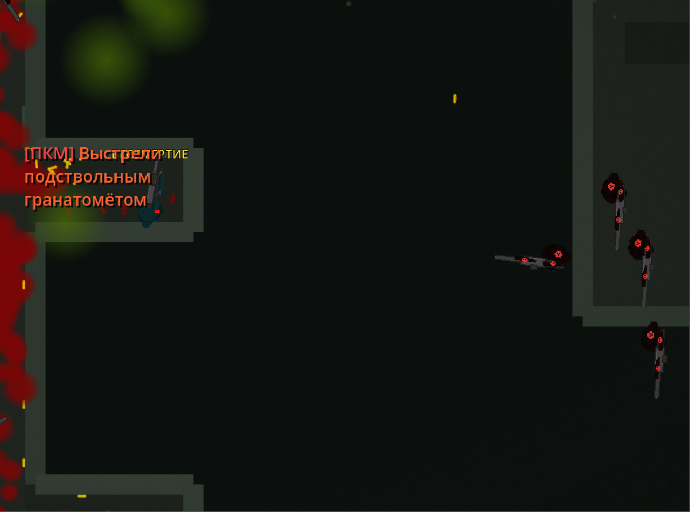

# Case Study: Issue #1672 — Add blocking wall in SewerLevel right starting corridor

## Summary

**Issue**: Enemies could appear (via navigation/patrolling) in the right starting corridor of the SewerLevel map before the turn at y=450, making the level feel broken and allowing enemies to spawn in unreachable/unexpected positions.

**Original request** (Russian): "сделай глухую стену 200px в правом стартовом коридоре (до поворота), чтоб туда не мог заспавниться враг (сейчас иногда это происходит, но легче исправить добавив стену)"

**Translation**: "Make a solid 200px wall in the right starting corridor (before the turn) so enemies cannot spawn there (this sometimes happens, but it's easier to fix by adding a wall)"

---

## Map Geometry — SewerLevel Coordinate Reference

```
Y=112   ┌────────────────────────┐  X=50–550  (Top Room, 500px wide)
        │   TopRoomGuard (200,280)              │
        │   TopRoomGrenadier (400,280)          │
Y=450   └──────────────┬─────────┘  WallTopRoom_Bottom (419,450, 262px wide)
                       │  Right alcove/corridor (X=288–550, 262px wide)
Y=650                  │ ← WallRightCorridorBlock should go HERE
                       │
Y=1362  ───────────────┴─────────────────────  Main corridor meets right branch
        Main corridor: X=112–288 (176px wide)
        Right branch: X=288–2100
Y=3088  (bottom, player start at Y=3050)
```

---

## Timeline of Events

| Time (UTC) | Event |
|---|---|
| 2026-03-28 04:01:03 | `be1421dc` — Initial commit with task details (issue setup) |
| 2026-03-28 04:03:30 | `193206fd` — First fix attempt: Added `WallRightCorridorBlock` at (419, 650) with `S_h200` (200×24px), updated navigation polygon |
| 2026-03-28 04:04:08 | `307716d8` — Reverted "Initial commit with task details" (cleanup) |
| 2026-03-28 04:04:12 | CI runs pass (all 5 checks green) on SHA `307716d8` |
| 2026-03-28 04:04:16 | AI posts solution draft log comment on PR #1673 |
| 2026-03-28 04:06:27 | AI posts "ready to merge" comment |
| 2026-03-28 04:29:27 | **Owner (Jhon-Crow) reports**: "всё ещё нет глухой стены" (still no solid wall) with screenshot showing enemies in corridor |

---

## Root Cause Analysis

### Root Cause 1 (Primary): Wall too narrow — 200px vs required 262px

The right starting corridor (alcove) spans from **x=288 to x=550**, making it **262px wide**.

The wall `WallRightCorridorBlock` was placed using shape `S_h200` (`size = Vector2(200, 24)`), centered at x=419. This means the wall covers:
- Left edge: 419 − 100 = **x=319**
- Right edge: 419 + 100 = **x=519**

**Gaps left open**:
- Left gap: x=288 to x=319 = **31px** — wide enough for enemies to navigate through
- Right gap: x=519 to x=550 = **31px** — wide enough for enemies to navigate through

Meanwhile, `WallTopRoom_Bottom` at position (419, 450) correctly uses `S_h262` (`size = Vector2(262, 24)`), which spans exactly x=288 to x=550, covering the full corridor width. The new wall should use the same shape.

### Root Cause 2 (Secondary): Visual mislead from CI passing

CI only checks code compilation/linting — not gameplay correctness. The wall was technically syntactically valid Godot scene data, so all CI checks passed, creating a false confidence signal.

### Why the navigation polygon update was partially correct

The navigation polygon was updated from `550, 450 → 288, 450` to `550, 650 → 288, 650`, which correctly moved the top corner of the right alcove from y=450 to y=650. This **does** restrict AI navigation in that area. However:

1. Enemies with `enable_flanking=true` or patrolling may attempt to reach that region through gameplay logic bypassing navigation
2. The physical wall collision doesn't match the nav polygon boundary — the collision gaps (31px each side) allow physical passage

---

## Evidence

### Screenshot from Owner (2026-03-28 04:29 UTC)



The screenshot shows enemies (red glowing figures) visible in the upper-right area of the level, near the right corridor. The kill notification shows a grenade launcher kill, consistent with `TopRoomGrenadier` at (400, 280).

### Relevant Scene Data (pre-fix)

```
# WallTopRoom_Bottom — CORRECTLY spans full 262px corridor
[node name="WallTopRoom_Bottom" type="StaticBody2D"]
position = Vector2(419, 450)
shape = SubResource("S_h262")  # size = Vector2(262, 24) ✓

# WallRightCorridorBlock — INCORRECTLY only 200px, 31px gaps on each side
[node name="WallRightCorridorBlock" type="StaticBody2D"]
position = Vector2(419, 650)
shape = SubResource("S_h200")  # size = Vector2(200, 24) ✗  (should be 262px)
```

### Navigation Polygon (after first fix — at y=650)

```
vertices = PackedVector2Array(50, 112, 550, 112, 550, 650, 288, 650, ...)
```

The nav polygon correctly clips the alcove at y=650 — but the physical collision doesn't fully match (gaps at sides).

---

## Proposed Solution

**Change `WallRightCorridorBlock` shape from `S_h200` to `S_h262`** and update the `ColorRect` offsets to match:

```gdscript
# Fix: use 262px shape (same as WallTopRoom_Bottom) instead of 200px
[node name="WallRightCorridorBlock" type="StaticBody2D" parent="Environment/Walls"]
position = Vector2(419, 650)
collision_layer = 4
collision_mask = 0

[node name="ColorRect" type="ColorRect" parent="Environment/Walls/WallRightCorridorBlock"]
offset_left = -131.0   # was -100.0
offset_top = -12.0
offset_right = 131.0   # was 100.0
offset_bottom = 12.0
color = Color(0.18, 0.22, 0.18, 1)

[node name="CollisionShape2D" type="CollisionShape2D" parent="Environment/Walls/WallRightCorridorBlock"]
shape = SubResource("S_h262")  # was S_h200

[node name="LightOccluder2D" type="LightOccluder2D" parent="Environment/Walls/WallRightCorridorBlock"]
occluder = SubResource("O_h262")  # was O_h200
```

This ensures the blocking wall is exactly 262px wide, matching the corridor width, with no gaps at either side wall.

---

## Additional Notes

- The `S_h262` and `O_h262` resources already exist in the scene file (used by `WallTopRoom_Bottom`), so no new sub-resources are needed
- The navigation polygon update (y=650 boundary) from the first fix is **correct and should be kept**
- No enemy placement changes are needed — the wall prevents navigation/patrolling into the dead-end section

---

## Files Changed

- `scenes/levels/SewerLevel.tscn` — WallRightCorridorBlock collision shape and visual rect corrected to 262px
- `docs/case-studies/issue-1672/` — this case study documentation
- `docs/case-studies/issue-1672/screenshot-owner-feedback-2026-03-28.png` — owner screenshot evidence
