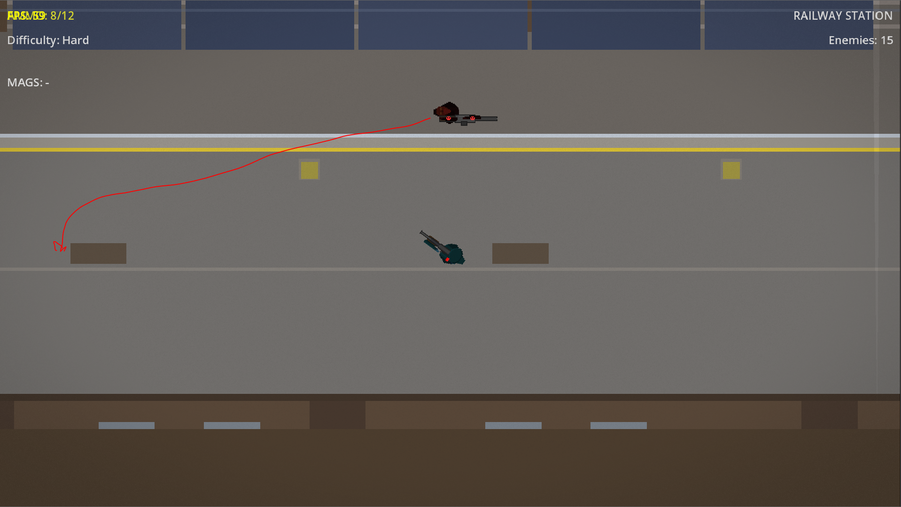
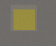
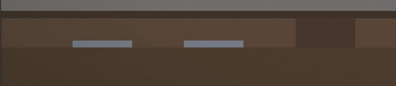

# Case Study: Issue #1724 — Update Railway Tracks (ЖД Пути) Map

## Problem Statement

The Railway Tracks map (`RailwayStationLevel.tscn`) had four visual/gameplay readability issues:

1. **Enemy too visible on spawn** — the gas mask enemy was placed at `(2000, 2900)`, fully visible to the player immediately upon entering the level.
2. **No lighting on platform** — the lamp posts on the platform had no actual light sources, making the platform area feel flat and unlit.
3. **Pillar obstacles not readable** — platform pillar `ColorRect` nodes used a near-floor grey color `Color(0.5, 0.48, 0.45)`, making them nearly invisible against the platform surface.
4. **Station entrance porch passable area not readable** — the porch/entrance area of the station building had no visual distinction, so players could not tell it was a passable (walkable) zone.

## Issue Screenshots

### 1. Enemy placement — gas mask enemy visible at spawn

The red line shows line-of-sight: the enemy at `(2000, 2900)` is immediately visible from the player start position.

### 2. Pillar obstacle color — not distinguishable from floor

The pillar `ColorRect` was `Color(0.5, 0.48, 0.45)` — almost identical to the surrounding floor.

### 3. Station building porch — passable area not readable

The station building entrance had no visual cue to indicate the porch area was passable.

## Root Cause Analysis

The Railway Tracks level was built with placeholder/default colors and without lighting nodes. The map geometry was functional but visually indistinct in several areas:

- **Enemy placement**: Placed in an open central area rather than behind cover, removing tactical tension.
- **Lighting**: `PointLight2D` nodes were never added to the lamp post sprites.
- **Obstacle readability**: `ColorRect` colors for pillars were picked from a mid-grey palette that blends with the platform floor.
- **Navigation readability**: Passable entry zones at the station building had no floor-tone differentiation from surrounding non-passable areas.

## Solution

Changes made in `scenes/levels/RailwayStationLevel.tscn`:

1. **Enemy repositioned**: Gas mask enemy moved from `(2000, 2900)` to `(900, 3075)` — behind `PlatformBench1` (the left platform bench), so it is not visible to the player on spawn.

2. **Platform lighting added**: Five `PointLight2D` nodes added at each lamp post position along the platform edge. Each light uses warm yellow gradient glow (`energy=1.2`, `texture_scale=3.5`, shadows enabled).

3. **Pillar color darkened**: Platform pillar `ColorRect` color changed from near-floor grey `Color(0.5, 0.48, 0.45)` to dark brown `Color(0.22, 0.20, 0.18)`, making obstacle columns clearly stand out.

4. **Porch floor strip added**: Two `ColorRect` nodes added at the station building entrance (`y=3298`–`3320`):
   - `StationPorchFloor`: lighter brown tone to indicate passable area
   - `StationPorchEdge`: thin trim line to separate porch from the main platform

## Files Changed

- `scenes/levels/RailwayStationLevel.tscn` — 78 insertions, 8 deletions

## Related

- Issue: https://github.com/Jhon-Crow/godot-topdown-MVP/issues/1724
- Pull Request: https://github.com/Jhon-Crow/godot-topdown-MVP/pull/1725
