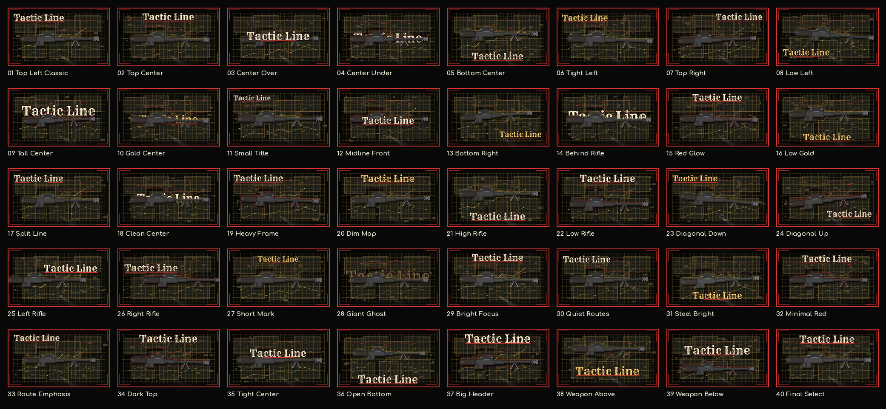

# Issue #1815 Case Study: Tactic Line Preview Posters

## Summary

Issue #1815 requested standalone poster/preview artwork for the game, saved in the repository `assets` folder and not wired into the game itself.

Original constraints:

- Include a large, readable `Tactic Line` title.
- Create four different poster versions if possible.
- Include at least one red/black two-color version.
- Make the poster visually clickable.
- Attach the poster result back to the issue comment thread.
- Collect issue data and research in `docs/case-studies/issue-1815`.

Feedback timeline:

- First follow-up on 2026-04-16: use `tactic_line_poster_close_quarters.png` as the base direction, remove player/enemy models, remove the bright center curves, add subtler route lines with nodes, and place armory weapons in the foreground.
- Second follow-up on 2026-04-16: move away from a dense weapon pile, try one-weapon centered versions, use only side-view armory sprites, include ASVK, produce roughly 20 images, and keep red/black variants mostly black.
- Third follow-up on 2026-04-16: the submitted 20-image batch did not follow the requested `assets/posters/tactic_line_poster_close_quarters.png` style. The owner specifically asked for that background and lettering, no oval on the background, a single ASVK on the foreground/top layer, a caption, and 20 ASVK-only versions.
- Fourth/latest follow-up on 2026-04-16: keep the current ASVK foreground idea, but remove the `ASVK` caption entirely so the only in-poster text is the game name, vary the `Tactic Line` placement, remove the frequent horizontal hatching so the map background stays like Close Quarters with large cells, and produce 40 experimental variants.

The current implementation addresses the fourth/latest follow-up.

## Collected Data

- `issue-data.json` contains the GitHub issue title/body/metadata.
- `issue-comments.json` contains current issue comments.
- `pr-comments.json` contains PR conversation feedback, including the four 2026-04-16 owner revision requests.
- `pr-review-comments.json` and `pr-reviews.json` preserve review-thread data; both were empty at collection time.
- Generated posters are stored in `../../../assets/posters/`.
- The reproducible generator is `../../../experiments/generate_tactic_line_posters.py`.
- The validation script is `../../../experiments/validate_tactic_line_posters.py`.

## Online Research Notes

Steam's graphical asset overview lists the main store capsule as `1232px x 706px` and describes that capsule as game logo plus artwork. That size remains the target for every poster so the result can work as a wide capsule-style preview.

Steam's graphical asset rules emphasize that base capsule images should be limited to game artwork, the game name, and any official subtitle. The current posters therefore keep visible text limited to the required `Tactic Line` title only, with no `ASVK` caption or extra text.

Google Play's feature graphic guidance is useful as general game preview-art guidance even though this repository is not shipping a Play Store asset: it recommends conveying the app/game experience, keeping the focal point near the center, avoiding overloading the image with fine details, and using color/brand consistency. The current posters use one centered or deliberately offset rifle, restrained route-node detail, and the same Close Quarters map/grid background.

Nielsen Norman Group's visual hierarchy guidance emphasizes contrast, scale, and grouping as ways to guide attention. The latest revision experiments with title scale and layer order while keeping the rifle and title as the only dominant elements.

Pillow's `ImageDraw.textbbox` API returns text bounds for TrueType fonts, which makes title placement reproducible and keeps the title from relying on generated/OCR text. Godot's `Image.save_png` API remains a viable future in-engine route for generated assets, but Pillow is used here because the issue asks for standalone repository artwork rather than runtime integration.

Sources:

- Steamworks graphical assets overview: https://partner.steamgames.com/doc/store/assets
- Steamworks graphical asset rules: https://partner.steamgames.com/doc/store/assets/rules
- Google Play preview asset guidance: https://support.google.com/googleplay/android-developer/answer/9866151
- Nielsen Norman Group visual hierarchy: https://www.nngroup.com/articles/visual-hierarchy-ux-definition/
- Pillow `ImageDraw.textbbox`: https://pillow.readthedocs.io/en/stable/reference/ImageDraw.html#PIL.ImageDraw.ImageDraw.textbbox
- Godot `Image.save_png`: https://docs.godotengine.org/en/stable/classes/class_image.html#class-image-method-save-png

## Existing Repository Inputs

The current posters reuse project assets instead of introducing unrelated stock art:

- `assets/sprites/weapons/asvk_topdown.png`
- `assets/sprites/effects/flashlight_cone_18deg.png`
- `assets/fonts/rye/Rye-Regular.ttf`
- `assets/fonts/neon/Comfortaa-Bold.ttf`

The ASVK asset is the current armory-menu path even though its file name says `topdown`; visually it is a side-profile armory-style sprite. The latest generator intentionally does not use player sprites, enemy sprites, non-ASVK weapon sprites, captions, oval/focus-field treatments, or dense scanline hatching.

## Current Implementation

All 40 individual posters use `1232x706` PNG dimensions. The first file intentionally preserves the reviewer-referenced path as the current Close Quarters-style experiment:

- `assets/posters/tactic_line_poster_close_quarters.png`
- `assets/posters/tactic_line_experiment_02.png`
- `assets/posters/tactic_line_experiment_03.png`
- `assets/posters/tactic_line_experiment_04.png`
- `assets/posters/tactic_line_experiment_05.png`
- `assets/posters/tactic_line_experiment_06.png`
- `assets/posters/tactic_line_experiment_07.png`
- `assets/posters/tactic_line_experiment_08.png`
- `assets/posters/tactic_line_experiment_09.png`
- `assets/posters/tactic_line_experiment_10.png`
- `assets/posters/tactic_line_experiment_11.png`
- `assets/posters/tactic_line_experiment_12.png`
- `assets/posters/tactic_line_experiment_13.png`
- `assets/posters/tactic_line_experiment_14.png`
- `assets/posters/tactic_line_experiment_15.png`
- `assets/posters/tactic_line_experiment_16.png`
- `assets/posters/tactic_line_experiment_17.png`
- `assets/posters/tactic_line_experiment_18.png`
- `assets/posters/tactic_line_experiment_19.png`
- `assets/posters/tactic_line_experiment_20.png`
- `assets/posters/tactic_line_experiment_21.png`
- `assets/posters/tactic_line_experiment_22.png`
- `assets/posters/tactic_line_experiment_23.png`
- `assets/posters/tactic_line_experiment_24.png`
- `assets/posters/tactic_line_experiment_25.png`
- `assets/posters/tactic_line_experiment_26.png`
- `assets/posters/tactic_line_experiment_27.png`
- `assets/posters/tactic_line_experiment_28.png`
- `assets/posters/tactic_line_experiment_29.png`
- `assets/posters/tactic_line_experiment_30.png`
- `assets/posters/tactic_line_experiment_31.png`
- `assets/posters/tactic_line_experiment_32.png`
- `assets/posters/tactic_line_experiment_33.png`
- `assets/posters/tactic_line_experiment_34.png`
- `assets/posters/tactic_line_experiment_35.png`
- `assets/posters/tactic_line_experiment_36.png`
- `assets/posters/tactic_line_experiment_37.png`
- `assets/posters/tactic_line_experiment_38.png`
- `assets/posters/tactic_line_experiment_39.png`
- `assets/posters/tactic_line_experiment_40.png`

A review contact sheet is also included:

- `assets/posters/tactic_line_poster_contact_sheet.png`



## Iteration History

- Iteration 0: initial four broad style directions were posted to the issue thread.
- Iteration 1: the four posters were revised toward the close-quarters/armory direction after the first feedback round.
- Iteration 2: a 20-image side-view armory batch was generated after the second feedback round, but it used several weapon types and an oval focus field.
- Iteration 3: the mixed-weapon output was replaced with 20 ASVK-only close-quarters variants using the requested background and Rye-style lettering, without the oval.
- Iteration 4: the current batch replaces the 20-image set with 40 experiments, removes the `ASVK` caption, keeps only `Tactic Line` as visible text, varies title placement and title/weapon layering, and removes the fine horizontal scanline pass.

## Validation

Generation command:

```bash
python3 experiments/generate_tactic_line_posters.py
```

Validation command:

```bash
python3 experiments/validate_tactic_line_posters.py
```

Validation checks performed:

- The 40 current poster variants exist under `assets/posters/`.
- Each individual poster is `1232x706`.
- The contact sheet exists and has valid PNG dimensions.
- Stale 20-image ASVK-caption outputs and older mixed-weapon poster files are removed from `assets/posters/`.
- The generator does not reference player or enemy character preview assets.
- The generator does not reference non-ASVK weapon sprite assets.
- The generator does not use the previous oval/focus-field/plinth drawing functions.
- The generator does not use the removed fine horizontal scanline pass.
- The generator has no `CAPTION`/`draw_caption` path and no literal `ASVK` text string for poster rendering.
- The red-dominant pixel ratio stays limited so the Close Quarters batch does not become a red/black variant set.
- The title is drawn as literal text by the script: `Tactic Line`.
- No scenes, scripts, resources, import metadata, or project settings reference the posters, so the images are not added to the game itself.

## Recommendation

Use the 40-image contact sheet for review and choose the final art direction from the current experiment set. The strongest current candidates are `tactic_line_poster_close_quarters.png` for the conservative Close Quarters style, `tactic_line_experiment_03.png` for a centered title-over-weapon layout, and `tactic_line_experiment_38.png` for a stronger title/weapon split.
