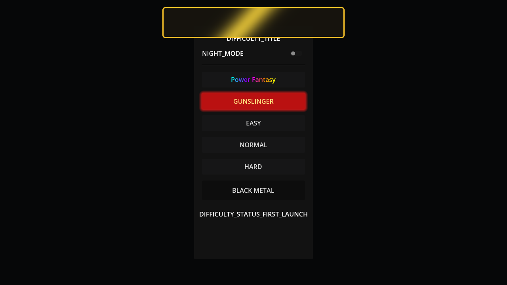

# Issue 1831 Case Study

## Summary

Issue: https://github.com/Jhon-Crow/godot-topdown-MVP/issues/1831

Request: when an item becomes available during play, show a top-screen Armory notification for 4 seconds with text `Открыто ... !`, slide-in/slide-out animation, a golden frame, and a shine animation similar to a Steam achievement notification.

## Collected Data

- `data/issue.json`: issue title, body, metadata, and empty comment list from GitHub.
- `data/issue-comments.json`: current issue comments from the GitHub API.
- `data/pr-1859.json`: prepared PR metadata and status before implementation.
- `data/related-prs-armory-unlock.json`: recent merged PRs involving Armory/unlock behavior.
- `data/related-prs-gold-shine.json`: recent merged PRs involving the gold shine visual language.
- `attachments/game_log_20260417_003202.txt`: owner-supplied runtime log from the PR feedback round.
- `attachments/game_log_20260417_003202_unlock_excerpt.txt`: filtered unlock/toast/error lines from the runtime log.
- `online-research.md`: external references used for the implementation approach.

## Timeline

- 2026-04-13 19:18:30 UTC: issue #1831 opened with the unlock notification requirement.
- 2026-04-16: prepared branch `issue-1831-8dd128f0f3cf` and draft PR #1859 existed with only the placeholder `.gitkeep` commit.
- 2026-04-16: local investigation found that `UnlockManager` emits availability signals and Armory slots/score buttons already use gold highlighting, but no global toast UI listened to those signals.
- 2026-04-16 21:41:29 UTC: PR feedback reported that the toast text did not include the category (`предмет`/`оружие`/`граната`) and item name, and that the exit animation appeared to replay many times.
- 2026-04-17 00:32:02 local log time: owner-supplied `game_log_20260417_003202.txt` starts from a Windows build.
- 2026-04-17 00:37:21, 00:37:44, 00:37:46 local log time: `UnlockManager` reports the Fine Motor Skills shot condition as available three times, confirming repeated availability signals can happen while the item is still locked in Armory.

## Existing System

- `UnlockManager` owns the unlock condition tables and emits:
  - `items_unlocked_by_condition(level_path)` when level-progress conditions become satisfied.
  - `items_unlocked_by_kill_condition` when stat-driven conditions become satisfied.
- `ArmoryMenu` checks `UnlockManager.is_*_condition_met(...)` and highlights locked, available slots in gold.
- Several level score screens call `UnlockManager.has_any_available_unlock()` to highlight the Armory button.
- The repo already has a reusable `scripts/shaders/gold_shine.gdshader` used by Armory slots, accordion buttons, and the Apply button.

## Root Cause

The unlock system had condition detection and gold visual affordances, but no top-level UI component that converted unlock availability signals into an immediate player-facing notification.

Because availability is not the same as permanent equipment unlock in this project, the notification must listen to the availability signals and announce locked items whose conditions just became satisfied. The Armory still remains responsible for the permanent unlock action by LMB hold.

Follow-up PR feedback exposed two presentation gaps in the first implementation:

- The queued notification stored only the display name, so the label could only render `Открыто <name> !` and could not include the requested category prefix.
- The runtime log shows repeated availability signals for the same locked item. The manager already deduplicates by unlock key, but the animation needed an explicit one-toast lifecycle so the exit slide is represented as a single phase rather than being restartable presentation state.

## Solution Direction

Add a global `UnlockNotificationManager` autoload:

- Extends `CanvasLayer` so the toast is drawn above gameplay and menus.
- Uses the existing Armory icon asset.
- Reuses `gold_shine.gdshader` for the requested shine animation.
- Queues notifications so several items becoming available from one condition are shown one after another.
- Carries unlock kind through the queue so the text renders `Открыт предмет Бронированная кожа !`, `Открыт оружие ... !`, or `Открыт граната ... !`.
- Seeds already-available locked items on startup so old save progress does not replay stale notifications.
- Shows only newly available locked items, avoiding notifications for already-open items.
- Keeps each toast visible for exactly `4.0` seconds between slide-in and slide-out.
- Tracks toast animation phase and keeps the slide-out phase to one scheduled tween segment per toast.

## Alternatives Considered

1. Add the notification only inside `ArmoryMenu`.
   - Rejected because the issue asks for notification when the item becomes available during play, and Armory may not be open.

2. Trigger from `GameManager.unlock_weapon`, `GrenadeManager.unlock_grenade`, and `ActiveItemManager.unlock_active_item`.
   - Rejected as the primary trigger because those methods run after the player manually opens the case in Armory. The issue wording follows the existing system language: items "become available" when conditions are met.

3. Use a third-party toast/notification plugin.
   - Rejected because the repo already has the necessary UI, shader, translation, and signal infrastructure, and a small native autoload keeps the dependency surface lower.

## Validation Plan

- Add regression tests for:
  - manager script existence,
  - requested text with unlock category and item name,
  - the Armored Skin example text `Открыт предмет Бронированная кожа !`,
  - 4-second display duration,
  - single slide-out contract,
  - only locked items with met conditions being collected.
- Run targeted GUT test when a Godot binary is available:
  - `godot --headless -s addons/gut/gut_cmdln.gd -gselect=test_unlock_notification_manager -gexit`
- Run broader checks:
  - GUT unit/integration suite,
  - `dotnet build`,
  - repository CI after push.

## Local Validation

- `git diff --check`: passed.
- `dotnet build`: passed.
- `Godot_v4.3-stable_mono_linux.x86_64 --headless -s addons/gut/gut_cmdln.gd -gselect=test_unlock_notification_manager -gexit`: passed 4 tests / 12 assertions.

## Follow-up Validation

- `git diff --check`: passed.
- `dotnet build`: passed with existing warnings and 0 errors.
- `/tmp/godot-4.3-mono/Godot_v4.3-stable_mono_linux_x86_64/Godot_v4.3-stable_mono_linux.x86_64 --headless --import`: completed, while reporting existing unrelated test script parse noise during import.
- Focused GUT rerun for `test_unlock_notification_manager`: Godot exited nonzero during autoload shutdown with existing `current_scene` null errors in several visual/effects autoloads; no target test assertion failure was visible in the captured log tail.

## Visual Preview

