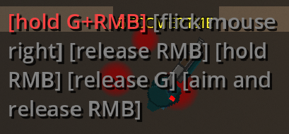

# Case Study: Issue #1881 — Grenade Tutorial Hint Overlaps Player

## Problem Statement

The grenade tutorial hint (showing the multi-step throw sequence) overlaps the player sprite instead of being positioned cleanly above it. This is visually confusing and degrades the tutorial experience.

**Reported by:** Jhon-Crow (repository owner)  
**Issue URL:** https://github.com/Jhon-Crow/godot-topdown-MVP/issues/1881  
**PR:** https://github.com/Jhon-Crow/godot-topdown-MVP/pull/1882

---

## Timeline / Sequence of Events

| Date | Event |
|------|-------|
| Issue opened | Owner reports grenade tutorial hint covering the player |
| Session 1 (GPT-5.4) | Initial fix: replaced fixed `Vector2(-150, -80 - index * HINT_SPACING)` with `HINT_PLAYER_CLEARANCE = 120` constant. Also merged main. |
| 2026-04-18 01:28 | Owner comments (in Russian): "Update from main, use new grenade training. When grenade training appears simultaneously with another hint, it should be above existing lines (currently overlaps)." |
| Session 2 (Claude Sonnet 4.6) | Added cumulative height stacking (`_update_all_hint_positions` accumulates `get_content_height()` instead of `index * HINT_SPACING`). Added new regression test. |
| 2026-04-18 ~01:30 | PR marked "ready to merge" by hive-mind. |
| 2026-04-20 08:43 | Owner reports: "grenade training still overlaps the player" — with screenshot (`overlap-screenshot.png`). |
| Session 3 (Claude Sonnet 4.6, this session) | Root cause analysis, deeper fix implemented. |

---

## Root Cause Analysis

### Issue A: Old fixed offset was insufficient for multi-line hints

**Main branch code:**
```gdscript
label.position = screen_pos + Vector2(-150, -80 - index * HINT_SPACING)
```
- Offset `-80` places the hint top 80px above the player.
- The grenade hint has 6 steps and wraps to ~3–4 lines at 300px width / font size 20.
- At 26px per line, the grenade hint is ~78–104px tall.
- Bottom of the hint = `screen_pos.y - 80 + 104 = screen_pos.y + 24` → **below the player**.

### Issue B: `get_content_height()` returns 0 on newly-created CanvasLayer-direct-child labels

In Godot 4, `RichTextLabel.get_content_height()` returns the height of the laid-out text content. For a `RichTextLabel` that is:
- A direct child of `CanvasLayer` (not inside a `Control`/`Container` layout node)
- Newly created, not yet rendered

...the internal text layout engine has not yet processed the text, so `get_content_height()` returns `0`. This means `h = maxf(0, HINT_MIN_HEIGHT) = 30` (30px) for the initial position call.

**Why `_process` doesn't reliably fix this:**  
`_update_all_hint_positions()` calls `get_content_height()` every frame. BUT: if the `RichTextLabel.size.x` was never set (defaulting to 0), the text layout engine cannot compute word-wrap positions, so it may continue returning 0 even after layout passes.

### Issue C: `size` not explicitly set on standalone labels

The code set `custom_minimum_size = Vector2(HINT_WIDTH, HINT_MIN_HEIGHT)` but NOT `size = Vector2(HINT_WIDTH, ...)`. For a Control inside a Container, the container enforces `custom_minimum_size`. For a standalone Control (CanvasLayer direct child), `size` remains at `(0, 0)` unless explicitly set. Without `size.x = HINT_WIDTH`, word-wrap never computes correctly.

### Issue D: Simultaneous hint stacking with stale heights

When two hints appear simultaneously (e.g., scope hint + grenade hint), `cumulative_y` in `_update_all_hint_positions` uses the heights from `_hint_labels` iteration order. If any height is stale (from issue B/C above), the stacking is wrong and hints overlap each other.

---

## Attempted Fixes

### Fix 1 (Session 1 — GPT-5.4)
- Added `HINT_PLAYER_CLEARANCE = 120` constant.
- Position: `screen_pos + Vector2(-150, -80 - index * HINT_SPACING)`  
  → Still used index-based fixed spacing; multi-line hints still overlapped.

### Fix 2 (Session 2 — Claude Sonnet 4.6)
- Changed to cumulative content height approach:
  ```gdscript
  var h: float = maxf(label.get_content_height(), HINT_MIN_HEIGHT)
  position.y = screen_pos.y - HINT_PLAYER_CLEARANCE - cumulative_y - h
  cumulative_y += h + HINT_SPACING
  ```
- **Still failed** because `get_content_height()` returns 0 (root cause C not addressed).

### Fix 3 (Session 3 — this session)
- Set `label.size = Vector2(HINT_WIDTH, HINT_MIN_HEIGHT)` explicitly to force word-wrap computation.
- Added `_hint_heights` dictionary that tracks the **maximum observed height** per hint, never shrinking below a committed value.
- Added `_estimate_hint_height(text)` text-based fallback that estimates height from BBCode-stripped text length — seeded into `_hint_heights` on creation so the first-frame position is reasonable.
- Added `_update_all_hint_positions.call_deferred()` after adding a new hint so all positions are recalculated after the layout frame.
- Refreshes `_hint_heights` every frame in `_update_all_hint_positions` when `get_content_height() > HINT_MIN_HEIGHT`.

---

## Technical Details

### Why `get_content_height()` is unreliable for CanvasLayer children

Godot 4's `RichTextLabel` computes text layout lazily. The computation requires:
1. A known width (`size.x > 0`) for word-wrap
2. A layout pass (triggered by being in the scene tree with correct size)

For labels added directly to `CanvasLayer`:
- `custom_minimum_size` is enforced during Container layout, not for standalone Controls
- `fit_content = true` makes the Control try to shrink/grow, but requires the layout system to be active
- Without explicit `size = Vector2(HINT_WIDTH, ...)`, the internal text layout engine uses width=0, making all text fit on one infinitely-wide line, but `get_content_height()` may still return 0 until the first draw call

### The `_hint_heights` tracking solution

```gdscript
var _hint_heights: Dictionary = {}  # hint_key -> float

# On creation: seed with text-based estimate
_hint_heights[hint_key] = maxf(_estimate_hint_height(text), HINT_MIN_HEIGHT)

# Every frame: update if layout gives a better reading
var measured: float = label.get_content_height()
if measured > HINT_MIN_HEIGHT:
    _hint_heights[hint_key] = measured
var h: float = _hint_heights.get(hint_key, HINT_MIN_HEIGHT)
```

This ensures:
- First-frame position uses a reasonable text-based estimate
- Once layout computes the real height, it's used from that frame forward
- Height never decreases to a stale 0 value

---

## Files Changed

- `scripts/levels/tutorial_level.gd` — hint positioning fix
- `tests/unit/test_tutorial_level.gd` — regression tests

---

## Evidence

**Screenshot showing persistent overlap (after fix 2):**  


The player sprite is visible in the top-right area of the hint text box. The hint bottom is approximately at the player's vertical position, confirming the clearance calculation underestimated hint height.

---

## Lessons Learned

1. **`get_content_height()` is unreliable for standalone Godot 4 Controls.** Always set `size.x` explicitly before reading `get_content_height()`.
2. **Pre-compute estimated heights** from text content as a fallback when layout hasn't run.
3. **Track max observed heights** — never let a stale 0 override a previously correct measurement.
4. **Test with actual content** — regression tests using fixed-height assumptions don't catch layout-engine issues that only appear at runtime.
