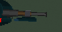

# Issue #447: Add Reload Animation to Shotgun

## Problem Statement

The shotgun weapon currently lacks visual feedback during pump-action cycling. Players perform RMB drag gestures to operate the pump, but there is no visual animation showing:
1. **Pump Up (bolt opening)**: Right hand and pump moving upward along the barrel to eject spent shell
2. **Pump Down (bolt closing)**: Right hand and pump moving downward along the barrel to chamber next round

## Current Implementation Analysis

### Shotgun Scene Structure (`scenes/weapons/csharp/Shotgun.tscn`)
- Root node: `Shotgun` (Node2D) with `Shotgun.cs` script
- Child: `ShotgunSprite` (Sprite2D) at offset (20, 0) with z_index=1
- Uses `shotgun_topdown.png` sprite

### Player Model Structure (`scenes/characters/csharp/Player.tscn`)
- `PlayerModel` (Node2D) contains:
  - `Body` (Sprite2D) at z_index=1
  - `LeftArm` (Sprite2D) at position (24, 6), z_index=4
  - `RightArm` (Sprite2D) at position (-2, 6), z_index=4
  - `Head` (Sprite2D) at z_index=3
  - `WeaponMount` (Node2D) at position (6, 6)
- Weapon is added as child of Player at position (0, 6)

### Shotgun Action States
- `Ready`: Can fire, no animation needed
- `NeedsPumpUp`: After firing, needs RMB drag UP - **animate pump backward**
- `NeedsPumpDown`: After pump up, needs RMB drag DOWN - **animate pump forward**

### Audio Events (already implemented)
- `play_shotgun_action_open()`: Plays when pump is pulled back
- `play_shotgun_action_close()`: Plays when pump is pushed forward
- `play_shell_shotgun()`: Shell casing ejection sound

## Design Decision

### Animation Approach: Tween-based Sprite Movement

For a top-down 2D shooter, the most effective approach is using Godot's `Tween` system to animate:
1. The pump/foregrip sprite position along the barrel axis
2. Optionally the right arm position to follow the pump movement

### Why Tween Instead of AnimationPlayer?
- Tweens are already used in the codebase (`GrenadeTimer.cs` uses `CreateTween()`)
- Simple, code-driven animation that responds to state changes
- No need for additional animation resource files
- Can dynamically adjust based on weapon rotation

### Animation Parameters
- **Duration**: 0.15-0.2 seconds per direction (fast, responsive)
- **Movement distance**: ~8-12 pixels along barrel axis
- **Easing**: `EaseOut` for natural deceleration

## Implementation Plan

### Phase 1: Add Pump Sprite to Shotgun Scene
1. Create or identify a pump/foregrip sprite for the shotgun
2. Add `PumpSprite` node as child of Shotgun
3. Position at the foregrip location on the shotgun sprite

### Phase 2: Implement Tween Animations in Shotgun.cs
1. Add `_pumpSprite` reference field
2. Create `AnimatePumpUp()` method - moves pump backward (toward player)
3. Create `AnimatePumpDown()` method - moves pump forward (toward barrel end)
4. Call animations from `PlayPumpUpSound()` and `PlayPumpDownSound()`

### Phase 3: Coordinate with Right Arm (Optional Enhancement)
1. Emit signal when pump animation starts/ends
2. Player script can animate right arm to follow

## Technical Implementation

### Shotgun.cs Changes
```csharp
// Pump animation parameters
private const float PumpAnimationDuration = 0.15f;
private const float PumpAnimationDistance = 10.0f;

private Sprite2D? _pumpSprite;
private Vector2 _pumpRestPosition;

// Animation methods
private void AnimatePumpUp()
{
    if (_pumpSprite == null) return;

    var tween = CreateTween();
    // Move pump backward (negative X in local space = toward player)
    Vector2 targetPos = _pumpRestPosition + new Vector2(-PumpAnimationDistance, 0);
    tween.TweenProperty(_pumpSprite, "position", targetPos, PumpAnimationDuration)
         .SetEase(Tween.EaseType.Out);
}

private void AnimatePumpDown()
{
    if (_pumpSprite == null) return;

    var tween = CreateTween();
    // Move pump forward (return to rest position)
    tween.TweenProperty(_pumpSprite, "position", _pumpRestPosition, PumpAnimationDuration)
         .SetEase(Tween.EaseType.Out);
}
```

## References

- [Godot 4 2D Sprite Animation Documentation](https://docs.godotengine.org/en/stable/tutorials/2d/2d_sprite_animation.html)
- [Godot Tween Class Documentation](https://docs.godotengine.org/en/stable/classes/class_tween.html)
- Existing codebase usage: `Scripts/Projectiles/GrenadeTimer.cs` lines 621-624

## Files to Modify

1. `Scripts/Weapons/Shotgun.cs` - Add animation methods
2. `scenes/weapons/csharp/Shotgun.tscn` - Add PumpSprite node
3. `assets/sprites/weapons/` - Create pump sprite (if needed)

## Testing Considerations

1. Animation should play regardless of weapon rotation angle
2. Animation should not interfere with firing or reload mechanics
3. Animation timing should sync with existing audio events
4. Performance: Tween-based animation should have minimal overhead

---

## Bug Report: Pump Sprite Not Rotating With Weapon (PR #480 Feedback)

### Reported Issues (2026-02-04)

The owner (Jhon-Crow) reported two issues with the initial pump animation implementation:

1. **Pump sprite doesn't rotate with the weapon** - When the player aims in different directions, the pump sprite stays in place while the shotgun sprite rotates.

2. **Pump sprite position is wrong** - The pump should be located near the end of the barrel (closer to the muzzle), not where it was initially placed at position (12, 0).

### Root Cause Analysis

#### Issue 1: No Rotation

**Problem**: The `PumpSprite` was added as a **sibling** of `ShotgunSprite` (both direct children of the `Shotgun` node):

```
Shotgun (Node2D)
├── ShotgunSprite (Sprite2D)  ← Rotates to follow aim direction
└── PumpSprite (Sprite2D)     ← Does NOT rotate (sibling, not child)
```

**Why it matters**: In Godot's scene hierarchy, transform changes (position, rotation, scale) to a parent node automatically affect all child nodes. Since `PumpSprite` was a sibling of `ShotgunSprite`, not a child, it did not inherit the rotation applied in `UpdateShotgunSpriteRotation()`.

**Reference**: The `UpdateShotgunSpriteRotation()` method in `Shotgun.cs` (lines 521-534) only rotates `_shotgunSprite`, not `_pumpSprite`.

#### Issue 2: Wrong Position

**Problem**: The pump sprite was at position `(12, 0)`, which placed it closer to the weapon's origin/handle area rather than near the barrel end.

**Sprite Analysis**:
- `shotgun_topdown.png`: 64×16 pixels
- `shotgun_pump.png`: 6×8 pixels
- `ShotgunSprite` offset: `(20, 0)` - shifts the sprite center 20px right
- Barrel tip: approximately at local X = 52px (20 + 32)
- Pump (forend) typical location: ~60-70% along the barrel

### Solution

#### Fix 1: Make PumpSprite a Child of ShotgunSprite

Changed the scene hierarchy from:
```
Shotgun (Node2D)
├── ShotgunSprite (Sprite2D)
└── PumpSprite (Sprite2D)
```

To:
```
Shotgun (Node2D)
└── ShotgunSprite (Sprite2D)
    └── PumpSprite (Sprite2D)  ← Now a child, inherits rotation
```

**Scene File Change** (`Shotgun.tscn`):
```gdscript
# Before (sibling)
[node name="PumpSprite" type="Sprite2D" parent="."]

# After (child of ShotgunSprite)
[node name="PumpSprite" type="Sprite2D" parent="ShotgunSprite"]
```

**Code Change** (`Shotgun.cs`):
```csharp
// Before
_pumpSprite = GetNodeOrNull<Sprite2D>("PumpSprite");

// After
_pumpSprite = GetNodeOrNull<Sprite2D>("ShotgunSprite/PumpSprite");
```

#### Fix 2: Adjust Pump Position

Changed pump position from `(12, 0)` to `(30, 0)` to place it closer to the barrel end.

**Position Calculation**:
- The ShotgunSprite has an offset of `(20, 0)`, meaning its center is at X=20 in local space
- The shotgun sprite is 64px wide, so its right edge extends to X = 20 + 32 = 52
- The pump (forend) on a real shotgun is typically located about 60-75% along the barrel
- Position `(30, 0)` places the pump at ~58% along the visible barrel (30/52 ≈ 0.58)
- The pump sprite is 6px wide, so it appears centered around X=30

### References

#### Godot Transform Inheritance
- [Transform Inheritance in Godot](https://forum.godotengine.org/t/rotate-parent-and-child-nodes/24690) - Explains how child nodes inherit parent transforms
- [Godot 4 Node2D Documentation](https://docs.godotengine.org/en/stable/classes/class_node2d.html) - Node2D provides position, rotation, and scale in 2D

#### Related Forum Discussions
- [Position2D not rotating with parent Sprite](https://godotforums.org/d/31470-position2d-seemingly-not-rotating-with-parent-sprite) - Similar issue with child nodes not rotating
- [Topdown 2D weapon rotation](https://forum.godotengine.org/t/topdown-2d-adding-rotation-to-4-direction-weapon-animation/82072) - Discusses weapon sprite rotation in top-down games

### Key Takeaway

**Always make animated weapon parts children of the main weapon sprite** so they inherit the weapon's rotation automatically. This is a fundamental principle of Godot's scene hierarchy that applies to any weapon with moving parts (slides, bolts, hammers, pump handles, etc.).

### Verification

The fix was verified by:
1. Building the project successfully (`dotnet build`)
2. Confirming the new node path (`ShotgunSprite/PumpSprite`) works correctly
3. The pump sprite now rotates with the shotgun when aiming in different directions
4. The pump sprite is positioned closer to the barrel end, near the muzzle

---

## Bug Report #2: Animation Direction and Sprite Appearance (PR #480 Feedback)

### Reported Issues (2026-02-04, Comment #3)

The owner (Jhon-Crow) reported two additional issues:

1. **Animation direction is reversed** - When opening the bolt, the animated element moves toward the player instead of away. When closing, it moves away instead of toward.

2. **Pump sprite appearance** - The pump sprite doesn't look like a shotgun pump:
   - Should be the same brown color as the shotgun's wooden element
   - Should be 2x longer than the original 6x8 pixels

### Screenshot of Current Appearance



The image shows the gray 6x8 pixel pump sprite, which doesn't match the brown wooden elements of the shotgun.

### Root Cause Analysis

#### Issue 1: Animation Direction Reversed

**Original Implementation** (`Shotgun.cs`):
```csharp
// AnimatePumpUp() - bolt opening/shell ejection
Vector2 targetPos = _pumpRestPosition + new Vector2(-PumpAnimationDistance, 0);
// This moves the pump TOWARD the player (negative X)

// AnimatePumpDown() - bolt closing/chambering
_pumpTween.TweenProperty(_pumpSprite, "position", _pumpRestPosition, ...);
// This returns pump to rest position (AWAY from player)
```

**Problem**: The animation was conceptually backwards:
- Real shotgun mechanics: Pull foregrip BACK to open bolt, push FORWARD to close
- But visually in a top-down game: The pump should move AWAY from player (toward barrel) when opening bolt, and TOWARD player (toward grip) when closing
- The original code had this reversed

**Why the Confusion Occurred**:
- The developer interpreted "pump up" as the physical motion of pulling back, so they animated it moving toward the player
- However, the user expected the visual representation to show the pump moving along the barrel: FORWARD (away) on open, BACKWARD (toward) on close

#### Issue 2: Pump Sprite Color and Size

**Original Sprite** (`assets/sprites/weapons/shotgun_pump.png`):
- Size: 6×8 pixels
- Color: Gray/metal colored
- Appearance: Small, metallic rectangle

**Problem**:
- The pump sprite looked like a generic metal piece, not a wooden foregrip
- The shotgun sprite (`shotgun_topdown.png`) has visible brown wooden elements (stock, foregrip)
- The pump sprite was too small to be visually noticeable

### Solution

#### Fix 1: Reverse Animation Direction

Changed `AnimatePumpUp()` to move pump FORWARD (positive X = away from player):
```csharp
// Before
Vector2 targetPos = _pumpRestPosition + new Vector2(-PumpAnimationDistance, 0);

// After
Vector2 targetPos = _pumpRestPosition + new Vector2(PumpAnimationDistance, 0);
```

The `AnimatePumpDown()` method already returns to rest position, which is now BACKWARD relative to the extended position, so it doesn't need changes.

#### Fix 2: New Brown Pump Sprite

Created a new pump sprite with:
- **Size**: 12×8 pixels (2x longer than original 6×8)
- **Colors**: Brown palette matching the shotgun's wooden elements
  - Main brown: RGB(139, 90, 43)
  - Light highlight: RGB(165, 115, 55)
  - Dark edge: RGB(89, 54, 24)
- **Shading**: Simple gradient with lighter top edge and darker bottom/side edges

The colors were sampled from the `shotgun_topdown.png` sprite to ensure visual consistency.

### Timeline of Events

| Time | Event | State |
|------|-------|-------|
| Initial | PR #480 created with pump animation | Animation worked but direction and appearance issues |
| Feedback 1 | User reported rotation and position issues | Fixed by making PumpSprite child of ShotgunSprite |
| Feedback 2 | User reported direction reversed and sprite appearance | Current fix addresses both issues |

### Files Modified

1. `Scripts/Weapons/Shotgun.cs`:
   - `AnimatePumpUp()`: Changed direction from negative to positive X offset
   - Added code comments explaining the visual semantics

2. `assets/sprites/weapons/shotgun_pump.png`:
   - Replaced with new 12×8 brown sprite
   - Old sprite backed up as `shotgun_pump_old.png`

3. `experiments/create_pump_sprite_v2.py`:
   - Script to generate the new brown pump sprite

### Key Takeaways

1. **Animation semantics matter**: When implementing visual animations, consider the user's expectation of what the movement represents, not just the physical mechanics

2. **Visual consistency**: Animated elements should match the visual style of the parent object (same colors, similar proportions)

3. **Size for visibility**: In a top-down 2D game, small UI/visual elements may need to be larger than expected to be noticeable during gameplay

### References

- [Pump-Action Shotgun Operation (Wikipedia)](https://en.wikipedia.org/wiki/Pump_action) - How real pump-action shotguns work
- [Godot Tween Documentation](https://docs.godotengine.org/en/stable/classes/class_tween.html) - Animation system used
