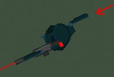
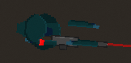
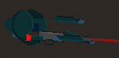
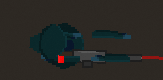
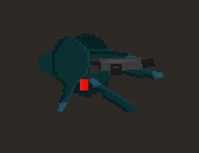

# Case Study: Issue #448 - Fix and Improve Player and Enemy Arm Models

## Overview

**Issue:** [#448 - fix исправь и доработай модели игрока и врага](https://github.com/Jhon-Crow/godot-topdown-MVP/issues/448)
**Pull Request:** [#449](https://github.com/Jhon-Crow/godot-topdown-MVP/pull/449)
**Date Created:** 2026-02-03
**Status:** Completed

## Related Files

- [solution-draft-log-pr-449.txt](solution-draft-log-pr-449.txt) - Complete AI solution draft execution log
- [left-arm-behind-back-bug.png](left-arm-behind-back-bug.png) - Screenshot of the positioning bug
- [left-arm-on-top-of-barrel-bug.png](left-arm-on-top-of-barrel-bug.png) - Screenshot of z_index layering issue

## Problem Statement

The original issue (in Russian) described a naming inconsistency in the player and enemy arm models:

> "сейчас у игрока и врага left_arm - это правое плечё, а right_arm - это правое предплечье
> сделай такую же левую руку (из двух частей), переименуй всё соответственно.
> анимации пока не меняй."

**Translation:**
- Currently for player and enemy, `left_arm` is actually the right shoulder, and `right_arm` is the right forearm
- Create a similar left arm (from two parts), rename everything accordingly
- Don't change animations yet

## Root Cause Analysis

### Historical Context

When the modular player model was originally created (PR #186), the arm naming was confusing:

1. **LeftArm node** was positioned at `(24, 6)` - on the RIGHT side of the character (front)
2. **RightArm node** was positioned at `(-2, 6)` - also on the RIGHT side, closer to body

This created a misleading situation where:
- `LeftArm` was actually the **right shoulder/upper arm** (the extended part holding the weapon)
- `RightArm` was actually the **right forearm/lower arm** (the part near the body)

The character only had visible arms on one side (the right/front side when facing right), which made the naming even more confusing.

### Visual Analysis

Original structure (top-down view, character facing right):
```
         Head
          |
Body ----[Arm1 at 24,6 "LeftArm"]---- Weapon
  |
  ----[Arm2 at -2,6 "RightArm"]
```

The "LeftArm" was actually the right arm's shoulder portion, and "RightArm" was the right arm's forearm portion.

## Solution Implementation

### 1. New Sprite Assets

Created properly named sprite files:

**Player sprites:**
- `player_right_shoulder.png` - Copy of original left_arm.png (the front shoulder)
- `player_right_forearm.png` - Copy of original right_arm.png (the front forearm)
- `player_left_shoulder.png` - Horizontally mirrored version (for back side)
- `player_left_forearm.png` - Horizontally mirrored version (for back side)

**Enemy sprites:**
- `enemy_right_shoulder.png` - Copy of original left_arm.png
- `enemy_right_forearm.png` - Copy of original right_arm.png
- `enemy_left_shoulder.png` - Horizontally mirrored version
- `enemy_left_forearm.png` - Horizontally mirrored version

### 2. Scene Structure Updates

Updated both `Player.tscn` and `Enemy.tscn` with new node structure:

**New arm nodes:**
| Node Name | Position | Z-Index | Purpose |
|-----------|----------|---------|---------|
| LeftShoulder | (24, -6) | 0 | Back arm shoulder (behind body) |
| LeftForearm | (-2, -6) | 0 | Back arm forearm (behind body) |
| RightShoulder | (24, 6) | 4 | Front arm shoulder (visible) |
| RightForearm | (-2, 6) | 4 | Front arm forearm (visible) |

**Position rationale:**
- X-coordinates: Both arms extend in the same direction (right, where the weapon is held), so both shoulders are at x=24 and both forearms at x=-2
- Y-coordinates: Right arm (front) has positive y=6, left arm (back) has negative y=-6, creating depth separation
- Z-index: Left arm (back side) has z-index=0 to appear behind body, right arm (front side) has z-index=4 to appear in front

### 3. Script Updates

#### GDScript (player.gd, enemy.gd)

Added new sprite references:
```gdscript
@onready var _left_shoulder_sprite: Sprite2D = $PlayerModel/LeftShoulder
@onready var _left_forearm_sprite: Sprite2D = $PlayerModel/LeftForearm
@onready var _right_shoulder_sprite: Sprite2D = $PlayerModel/RightShoulder
@onready var _right_forearm_sprite: Sprite2D = $PlayerModel/RightForearm
```

Added legacy aliases for backward compatibility (animations not changed per requirements):
```gdscript
@onready var _left_arm_sprite: Sprite2D = $PlayerModel/RightShoulder
@onready var _right_arm_sprite: Sprite2D = $PlayerModel/RightForearm
```

Updated `_set_all_sprites_modulate()` to apply colors to all 4 arm parts.

#### C# (Player.cs)

Similar changes with new fields and legacy aliases for backward compatibility with existing animation code.

### 4. Updated Supporting Scripts

- `last_chance_effects_manager.gd` - Updated comments to reflect new node names
- `penultimate_hit_effects_manager.gd` - Updated comments to reflect new node names
- `death_animation_component.gd` - No code changes needed (uses legacy aliases)

## Files Changed

### New Files
- `assets/sprites/characters/player/player_right_shoulder.png`
- `assets/sprites/characters/player/player_right_forearm.png`
- `assets/sprites/characters/player/player_left_shoulder.png`
- `assets/sprites/characters/player/player_left_forearm.png`
- `assets/sprites/characters/enemy/enemy_right_shoulder.png`
- `assets/sprites/characters/enemy/enemy_right_forearm.png`
- `assets/sprites/characters/enemy/enemy_left_shoulder.png`
- `assets/sprites/characters/enemy/enemy_left_forearm.png`
- `experiments/create_left_arm_sprites.py`
- `docs/case-studies/issue-448/README.md`

### Modified Files
- `scenes/characters/Player.tscn`
- `scenes/characters/csharp/Player.tscn`
- `scenes/objects/Enemy.tscn`
- `scripts/characters/player.gd`
- `scripts/objects/enemy.gd`
- `scripts/autoload/last_chance_effects_manager.gd`
- `scripts/autoload/penultimate_hit_effects_manager.gd`
- `Scripts/Characters/Player.cs`

### Removed Files
- `assets/sprites/characters/player/player_left_arm.png` (replaced)
- `assets/sprites/characters/player/player_right_arm.png` (replaced)
- `assets/sprites/characters/enemy/enemy_left_arm.png` (replaced)
- `assets/sprites/characters/enemy/enemy_right_arm.png` (replaced)

## Backward Compatibility

The solution maintains backward compatibility with existing animation code through legacy aliases:
- `_left_arm_sprite` points to `RightShoulder` (what animations expect)
- `_right_arm_sprite` points to `RightForearm` (what animations expect)

This allows the existing animation system (walking, grenade throwing, reloading) to continue working without changes, as requested in the issue.

## Testing Notes

The following should be verified:
1. Player and enemy models display correctly with 4 arm parts
2. Walking animation works correctly (uses legacy arm references)
3. Grenade throw animation works correctly
4. Reload animation works correctly
5. Health color changes apply to all arm parts
6. Death animation works correctly
7. Last chance/penultimate hit effects apply saturation to all sprites

## Bug Fix: Left Arm Positioning Error

### Issue Discovery

After the initial implementation, the repository owner reported that the left arm appeared to go behind the player's back:

> "сейчас левая рука игрока уходит за спину (должна быть с противоположной стороны)."
> (Translation: "Currently the player's left arm goes behind the back (should be on the opposite side).")



### Root Cause

The initial implementation incorrectly mirrored the arm positions on the wrong axis:

**Incorrect positions (initial implementation):**
- LeftShoulder: (-24, -6) - mirrored on X-axis, putting it on the LEFT side
- LeftForearm: (2, -6) - slightly off, near center

**Correct positions (fixed):**
- LeftShoulder: (24, -6) - same X as right shoulder, different Y for depth
- LeftForearm: (-2, -6) - same X as right forearm, different Y for depth

### Understanding Top-Down Arm Positioning

In a top-down view with the character facing right:
- Both arms extend in the SAME direction (towards the weapon on the right)
- The difference is in the Y-axis (depth): positive Y = "in front", negative Y = "behind"
- The left arm should be directly BEHIND the right arm, not horizontally mirrored

```
Top-down view (character facing right):

    Head  ← behind (negative Y)
     |
   Body   ← center
     |
    Arms  → in front (positive Y)

         ↓ weapon direction (positive X)
```

### Files Fixed
- `scenes/characters/Player.tscn`
- `scenes/characters/csharp/Player.tscn`
- `scenes/objects/Enemy.tscn`

## Bug Fix #2: Left Forearm Not Visible / Not Attached to Weapon

### Issue Discovery

After the first position fix, the repository owner reported two remaining issues:

> "1. левого предплечья не видно"
> "2. левая рука должна быть прикреплена к оружию (быть чуть под углом)"
>
> (Translation:
> 1. "Left forearm is not visible"
> 2. "Left arm should be attached to the weapon (at a slight angle)")



### Root Cause Analysis

Looking at the reference image, it became clear that:

1. **The left forearm (supporting hand) should be visible** - It needs to be in front of the weapon sprite, not behind
2. **The left forearm should grip the weapon's foregrip** - It should be positioned much further forward (higher X value), where a supporting hand would naturally grip a rifle
3. **The left forearm needs rotation** - To appear natural, the forearm should be at a slight angle

### Previous Incorrect Implementation

```
LeftForearm:
  - position = (-2, -6)  ← Behind body, same X as right forearm
  - z_index = 0          ← Behind everything (hidden by body and weapon)
  - rotation = 0         ← No angle
```

### Corrected Implementation

```
LeftForearm:
  - position = (32, 4)   ← Forward on weapon foregrip area, slightly below center
  - z_index = 3          ← Above weapon (z=2) but below front arm (z=4)
  - rotation = 0.3       ← ~17° angle for natural grip appearance
```

### Position Calculation Rationale

1. **X = 32**: The weapon mount is at X=0 with weapon offset of 20, so the foregrip area is approximately X=25-35. Position 32 places the hand on the forward grip area of the rifle.

2. **Y = 4**: Slightly positive (toward "front" in top-down view) but not as far as the right arm (Y=6), so it appears to reach across/under the weapon.

3. **Z-index = 3**: The weapon sprite has z-index 2, and the right arm has z-index 4. Setting the left forearm to z-index 3 makes it appear on top of the weapon but still behind the primary (right) arm.

4. **Rotation = 0.3 radians (~17°)**: A slight clockwise rotation gives the forearm a natural angled appearance as it grips the foregrip.

### Visual Representation

```
Top-down view (character facing right, holding rifle):

        [Head]
          |
      [Body]---[RightShoulder]---[RightForearm/hand at trigger]
          |                              |
    [LeftShoulder]                  [WEAPON]=====>
          |                              |
      [LeftForearm/supporting hand at foregrip, angled]
```

### Files Changed

- `scenes/characters/Player.tscn` - Updated LeftForearm position, z_index, rotation
- `scenes/characters/csharp/Player.tscn` - Updated LeftForearm position, z_index, rotation
- `scenes/objects/Enemy.tscn` - Updated LeftForearm position, z_index, rotation

## Bug Fix #3: Left Arm Should Be Under Weapon Barrel with Visible Shoulder

### Issue Discovery

After the foregrip positioning fix, the repository owner reported:

> "1. левая рука должна быть под стволом"
> "2. у левой руки должно быть плечо как у правой"
>
> (Translation:
> 1. "Left arm should be under the barrel"
> 2. "Left arm should have a shoulder like the right arm")

### Root Cause Analysis

The previous fix set `z_index = 3` for the LeftForearm to make it visible above the weapon. However, this caused the supporting hand to appear ON TOP of the weapon barrel, which looks unnatural. The supporting hand should be UNDER the barrel while still being visible.

Additionally, the LeftShoulder had `z_index = 0`, which placed it completely behind the body sprite, making it invisible.

### Understanding Z-Index Layering

The z_index values control the render order in Godot:

**Previous (incorrect) z_index values:**
| Element | Z-Index | Result |
|---------|---------|--------|
| LeftShoulder | 0 | Hidden behind body |
| Body | 1 | Visible |
| LeftForearm | 3 | Above weapon (incorrect) |
| Weapon | 1-2 | Below left forearm |
| RightArm | 4 | Front arm visible |

**Corrected z_index values:**
| Element | Z-Index | Result |
|---------|---------|--------|
| LeftShoulder | 1 | Same as body (visible alongside) |
| Body | 1 | Visible |
| LeftForearm | 1 | Same as weapon, but renders before weapon due to tree order |
| Weapon | 1-2 | Above left forearm (correct) |
| RightArm | 4 | Front arm visible |

### The Tree Order Solution

In Godot, when two sprites have the same z_index, the render order is determined by their position in the scene tree (earlier = renders behind). Since the arm sprites are siblings of the WeaponMount in PlayerModel, and they come BEFORE WeaponMount in the tree, they render behind the weapon when both have z_index = 1.

**Tree structure:**
```
PlayerModel
  ├── Body (z=1)
  ├── LeftShoulder (z=1) ← renders before weapon
  ├── LeftForearm (z=1)  ← renders before weapon
  ├── RightShoulder (z=4)
  ├── RightForearm (z=4)
  ├── Head (z=3)
  └── WeaponMount        ← weapon rendered last in z=1 group
       └── Weapon (z=1-2)
```

### Files Changed

- `scenes/characters/Player.tscn` - Set LeftShoulder and LeftForearm z_index to 1
- `scenes/characters/csharp/Player.tscn` - Set LeftShoulder and LeftForearm z_index to 1
- `scenes/objects/Enemy.tscn` - Set LeftShoulder and LeftForearm z_index to 1
- `scripts/characters/player.gd` - Updated code that sets z_index values at runtime

### Visual Result

The left arm is now:
1. **Visible** - Both shoulder and forearm can be seen
2. **Under the barrel** - The supporting hand grips from below, not above
3. **Properly connected** - The shoulder is visible and connects to the forearm

## Lessons Learned

1. **Clear naming conventions matter** - Using left/right naming for parts that were actually both on the right side caused confusion
2. **Plan for bilateral symmetry** - Character models should anticipate having matching limbs on both sides
3. **Legacy compatibility is important** - When refactoring, maintaining backward compatibility allows gradual migration
4. **Document the model structure** - A clear diagram showing node positions and purposes helps future development
5. **Understand the coordinate system** - In top-down games, "left/right" arms don't mean "left/right" screen positions; they refer to anatomical left/right from the character's perspective, which translates to depth (Y-axis) in a top-down view facing right
6. **Visual testing is essential** - Position calculations should be verified visually, not just logically
7. **Consider weapon attachment points** - In games with held weapons, supporting hands need to be positioned at logical grip points on the weapon, not just mirrored from the primary hand
8. **Z-ordering affects visibility** - Sprites with lower z-index can be completely hidden by other sprites, making position changes alone insufficient
9. **Rotation adds realism** - Small rotation values make posed limbs look more natural than perfectly horizontal positioning
10. **Tree order matters for same z_index** - When sprites have identical z_index values, Godot renders them in scene tree order (earlier nodes render behind later nodes). This can be used strategically to layer sprites without changing z_index
11. **"Under" vs "behind" distinction** - In game rendering, "under the barrel" (partially visible but layered below) is different from "behind the body" (completely hidden). The z_index must be chosen carefully to achieve the desired visual effect

## Bug Fix #4: Left Shoulder Disconnected from Forearm

### Issue Discovery

After the z_index layering fix, the repository owner reported:

> "не вижу изменений"
> "так же левое плечё отединено от предплечья"
>
> (Translation:
> 1. "I don't see changes"
> 2. "Also left shoulder is disconnected from forearm")



### Root Cause Analysis

The previous fix incorrectly positioned the LeftForearm:

**Previous (incorrect) positions:**
- LeftShoulder: (24, -6) - Forward position (X=24), back side (Y=-6)
- LeftForearm: (32, 4) - Even more forward (X=32), but FRONT side (Y=4)

The problem: The LeftForearm was positioned at Y=4 (almost on the front side) while LeftShoulder was at Y=-6 (back side). This created a massive disconnect between the two arm parts - they were on opposite sides of the character!

### The Correct Solution

Looking at how the right arm works correctly:
- RightShoulder: (24, 6) - Forward, front side
- RightForearm: (-2, 6) - Back near body, SAME Y as shoulder

Both right arm parts share the same Y coordinate (Y=6), which places them on the same "plane" of the character. This makes them visually connected.

The left arm should follow the same pattern - both parts should share the same Y coordinate (Y=-6):
- LeftShoulder: (24, -6) - Forward, back side
- LeftForearm: (-2, -6) - Back near body, SAME Y as shoulder

**Corrected positions:**
| Part | X | Y | Rationale |
|------|---|---|-----------|
| LeftShoulder | 24 | -6 | Forward (like right shoulder), back plane |
| LeftForearm | -2 | -6 | Near body (like right forearm), SAME back plane |

### Visual Comparison

**Before (disconnected):**
```
                    [LeftForearm at Y=4]
                           |
Body ---[LeftShoulder at Y=-6]
         (gap!)
```

**After (connected):**
```
Body ---[LeftForearm at Y=-6]---[LeftShoulder at Y=-6]
         (properly connected on same plane)
```

### Key Insight

The left arm structure should MIRROR the right arm structure in terms of X positions, but use the opposite Y value for depth:

| Right Arm | Position | Left Arm (Mirrored) | Position |
|-----------|----------|---------------------|----------|
| RightShoulder | (24, 6) | LeftShoulder | (24, -6) |
| RightForearm | (-2, 6) | LeftForearm | (-2, -6) |

The forearm at X=-2 is closer to the body, and the shoulder at X=24 extends toward the weapon. Both arms extend in the same direction (positive X toward the weapon), just at different depths (Y=6 for front/right arm, Y=-6 for back/left arm).

### Files Changed

- `scenes/characters/Player.tscn` - Fixed LeftForearm position from (32, 4) to (-2, -6), removed rotation
- `scenes/characters/csharp/Player.tscn` - Same fix
- `scenes/objects/Enemy.tscn` - Same fix
- `docs/case-studies/issue-448/left-arm-disconnected-bug.png` - Added screenshot of the issue

### Additional Lesson Learned

12. **Arm parts must share their Y coordinate** - In a top-down 2D game, arm segments that form a continuous limb must be on the same "depth plane" (same Y coordinate). Placing arm parts on different Y values causes visual disconnection, making the arm appear broken or detached

## Bug Fix #5: Left Arm Not Gripping Weapon

### Issue Discovery

After the previous fix that connected the shoulder and forearm, the repository owner reported:

> "левая рука должна держаться за оружие."
> "сейчас не касается его"
>
> (Translation:
> 1. "Left arm should hold/grip the weapon"
> 2. "Currently it doesn't touch it")



### Root Cause Analysis

The previous fix positioned the left arm to be visually connected (shoulder to forearm), but failed to position it where it would actually grip the weapon. The left forearm at (-2, -6) is near the body, not on the weapon's foregrip.

**Previous (incorrect) positions:**
- LeftShoulder: (24, -6) - Extended forward but on back plane
- LeftForearm: (-2, -6) - Near body, NOT touching weapon

The issue is a fundamental misunderstanding of the support hand position. In a proper two-handed rifle grip:
- The **primary hand (right)** is at the trigger/grip area of the weapon (near body, X around -2 to 6)
- The **support hand (left)** is at the foregrip area of the weapon (further forward, X around 15-25)

### Understanding Support Hand Position

Looking at the weapon structure:
- WeaponMount is at (0, 6) in Player scene
- Weapon sprite has offset of (20, 0), extending the weapon forward
- The foregrip area is approximately at X=15-25 from player center

The support hand (left forearm) needs to:
1. **Reach forward** to the foregrip area (X around 18-20)
2. **Be positioned near the weapon's Y** (Y closer to 0-2, not -6)
3. **Have a slight angle** for natural grip appearance

### The Correct Solution

The left arm needs a completely different posture than simply mirroring the right arm's positions:

**New positions:**
| Part | Old Position | New Position | Rationale |
|------|--------------|--------------|-----------|
| LeftShoulder | (24, -6) | (8, -2) | Positioned to connect body to the reaching forearm |
| LeftForearm | (-2, -6) | (18, 2) + rotation 0.3 | At foregrip, reaching toward weapon |

### Visual Representation

```
Top-down view (character facing right, holding rifle):

        [Head]
          |
    [LeftShoulder at (8,-2)]---[LeftForearm at (18,2) with angle]
          |                              |
      [Body]---[RightShoulder]---[RightForearm at trigger]
          |                              |
                                    [WEAPON]=====>
                                         |
                              [LeftForearm grips foregrip here]
```

The key insight is that the left arm **crosses toward the weapon** rather than staying parallel to the right arm. The support hand reaches across to grip the weapon's foregrip area.

### Coordinate System Analysis

In the top-down coordinate system with character facing right:
- **X-axis**: Positive = toward weapon/muzzle direction
- **Y-axis**: Positive = "front" (right arm side), Negative = "back" (left arm side)

The left arm needs to **transition from negative Y (back) to positive Y (front)** as it reaches across to grip the weapon:
- LeftShoulder: Y = -2 (slightly back, near body origin)
- LeftForearm: Y = 2 (crossing toward the front where the weapon is)

### Files Changed

- `scenes/characters/Player.tscn`
  - LeftShoulder: position changed from (24, -6) to (8, -2)
  - LeftForearm: position changed from (-2, -6) to (18, 2), added rotation = 0.3
- `scenes/characters/csharp/Player.tscn` - Same changes
- `scenes/objects/Enemy.tscn` - Same changes
- `docs/case-studies/issue-448/left-arm-not-gripping-bug.png` - Added screenshot

### Additional Lessons Learned

13. **Support hand position differs from primary hand** - In two-handed weapon grips, the support hand (left) grips a different part of the weapon than the primary hand (right). Simply mirroring positions doesn't work; each hand has a specific functional position on the weapon.

14. **Arms can cross depth planes** - Unlike simple bilateral symmetry, a support arm may need to cross from the "back" Y plane to near the "front" Y plane to reach the weapon. The arm's path should follow anatomical logic, not geometric mirroring.

15. **Consider the weapon's grip points** - Foregrip position (for support hand) is typically at X=15-25 on the weapon, while trigger/pistol grip (for primary hand) is near X=0-5. Position arms based on these functional attachment points.

## Bug Fix #6: Arms Separating at Elbow During Grenade Throw

### Issue Discovery

After the previous positioning fixes, the repository owner reported:

> "руки разделяются в локте, особенно это заметно при броске гранаты"
> (Translation: "Arms separate at the elbow, especially noticeable during grenade throw")



### Root Cause Analysis

The arm separation issue occurs during animations (grenade throw, reload) because:

1. The legacy animation code uses two sprite references:
   - `_left_arm_sprite` → points to `RightShoulder` (the front arm's shoulder)
   - `_right_arm_sprite` → points to `RightForearm` (the front arm's forearm)

2. These references were created when each arm was a SINGLE sprite. Now that each arm has TWO parts (shoulder + forearm), the animation code treats them as independent sprites.

3. During grenade throw animation, the code applies DIFFERENT offsets to each sprite:
   - `_left_arm_sprite` (RightShoulder) moves with offsets like `ARM_LEFT_RELAXED = Vector2(-20, 2)`
   - `_right_arm_sprite` (RightForearm) moves with offsets like `ARM_RIGHT_THROW = Vector2(-4, -2)`

4. Since the offsets are different, the shoulder and forearm move to different positions, causing the visual "separation at the elbow."

### Example: How Separation Occurs

During the THROW phase of grenade animation:

**Positions before animation:**
- RightShoulder (base): (24, 6)
- RightForearm (base): (-2, 6)

**Animation offsets applied:**
- Shoulder offset: `ARM_LEFT_RELAXED = (-20, 2)` → target (4, 8)
- Forearm offset: `ARM_RIGHT_THROW = (-4, -2)` → target (-6, 4)

**Result:** The shoulder moves to (4, 8) while the forearm moves to (-6, 4) - a gap of 10 pixels in X and 4 pixels in Y!

### The Solution

Since `_left_arm_sprite` (RightShoulder) and `_right_arm_sprite` (RightForearm) are both parts of the SAME ARM, they must move TOGETHER during animations. The fix applies the same offset to both sprites:

```gdscript
# Calculate the offset being applied to the shoulder
var shoulder_offset := left_arm_target - _base_left_arm_pos
# Apply the same offset to the forearm to keep arm connected
var forearm_connected_target := _base_right_arm_pos + shoulder_offset

if _left_arm_sprite:
    _left_arm_sprite.position = _left_arm_sprite.position.lerp(left_arm_target, lerp_speed)
    _left_arm_sprite.rotation = lerpf(_left_arm_sprite.rotation, left_arm_rot, lerp_speed)

if _right_arm_sprite:
    # Apply the same offset as the shoulder to keep the arm connected
    _right_arm_sprite.position = _right_arm_sprite.position.lerp(forearm_connected_target, lerp_speed)
    _right_arm_sprite.rotation = lerpf(_right_arm_sprite.rotation, left_arm_rot, lerp_speed)
```

### Files Changed

- `scripts/characters/player.gd`:
  - `_update_grenade_animation()` - Fixed shoulder/forearm to move together
  - `_update_reload_animation()` - Fixed shoulder/forearm to move together
  - Walking animation code - Fixed both arm parts to use same offset

### Key Code Changes

**Grenade animation (line ~2126):**
```gdscript
# Before: Applied different offsets to shoulder and forearm
# After: Calculate shoulder offset and apply same offset to forearm
```

**Reload animation (line ~2299):**
```gdscript
# Before: Applied different offsets to shoulder and forearm
# After: Calculate shoulder offset and apply same offset to forearm
```

**Walking animation (line ~567):**
```gdscript
# Before: Shoulder moved with +arm_swing, forearm with -arm_swing (opposite)
# After: Both parts move with +arm_swing (same direction)
```

### Additional Lesson Learned

16. **Multi-part limbs must move as a unit** - When a limb consists of multiple sprites (shoulder + forearm), animation code must move all parts by the same offset from their respective base positions. The relative positions between parts should remain constant during movement, otherwise the limb will appear to disconnect or stretch.

## Bug Fix #7: Improved Arm Connection Logic - Forearm Relative to Shoulder

### Issue Discovery

Despite the previous fix (#6), the arms were still separating during grenade throw animation:

> "всё ещё разъединяется при броске гранаты"
> (Translation: "Still separating during grenade throw")

### Root Cause Analysis - Deeper Issue

The previous fix (Bug Fix #6) calculated the forearm position as:
```gdscript
var shoulder_offset := left_arm_target - _base_left_arm_pos
var forearm_connected_target := _base_right_arm_pos + shoulder_offset
```

This approach had a subtle flaw: it applied the same **offset** to both the shoulder and forearm base positions. However, this doesn't guarantee the forearm stays connected to the shoulder at the elbow during the lerp animation.

**The problem with the previous approach:**

When both sprites lerp from their current positions to their targets at the same rate, they only arrive at the correct relative position at the END of the animation. During the transition, they can be at different relative positions if their starting points were different.

### The Correct Solution

The forearm should be positioned **relative to the shoulder's current position**, not calculated from base positions. This ensures the arm stays connected at the elbow at ALL times during the animation, not just at the start and end.

**New approach:**

1. Store the offset from shoulder to forearm at initialization:
```gdscript
# In _ready():
_forearm_shoulder_offset = _base_right_arm_pos - _base_left_arm_pos
# Result: (-2, 6) - (24, 6) = (-26, 0)
```

2. Calculate forearm target as shoulder target + offset:
```gdscript
# In animation functions:
var forearm_connected_target := left_arm_target + _forearm_shoulder_offset
```

**Why this works better:**

With this approach, the forearm target is ALWAYS exactly 26 pixels to the left of the shoulder target (in X direction). Regardless of where the shoulder is moving to, the forearm will be at the correct relative position to maintain the elbow connection.

### Code Changes

**New variable added (line ~1236):**
```gdscript
## Offset from shoulder to forearm (forearm relative to shoulder, keeps arm connected).
## This is calculated as: forearm_pos - shoulder_pos, so forearm = shoulder + offset.
var _forearm_shoulder_offset: Vector2 = Vector2.ZERO
```

**Initialization in _ready() (line ~281):**
```gdscript
# Calculate the offset from shoulder to forearm (keeps arm connected at elbow).
# _left_arm_sprite is RightShoulder, _right_arm_sprite is RightForearm.
# This offset is applied to shoulder position to get forearm position.
if _left_arm_sprite and _right_arm_sprite:
    _forearm_shoulder_offset = _base_right_arm_pos - _base_left_arm_pos
```

**Recalculation in _apply_weapon_arm_offsets() (line ~535):**
```gdscript
# Recalculate forearm-shoulder offset when base positions change
# This ensures the arm stays connected at the elbow regardless of weapon type
_forearm_shoulder_offset = _base_right_arm_pos - _base_left_arm_pos
```

**Updated grenade animation (line ~2138):**
```gdscript
# The forearm is positioned RELATIVE to the shoulder using _forearm_shoulder_offset
# Forearm target = shoulder target + forearm-shoulder offset (set at _ready)
var forearm_connected_target := left_arm_target + _forearm_shoulder_offset
```

**Updated reload animation (line ~2311):**
```gdscript
# Same approach as grenade animation
var forearm_connected_target := left_arm_target + _forearm_shoulder_offset
```

### Visual Explanation

**Before (Bug Fix #6 - offset from base):**
```
Shoulder base: (24, 6)
Forearm base: (-2, 6)
Offset: (-20, 2)  ← animation offset

During animation:
- Shoulder target: (24, 6) + (-20, 2) = (4, 8)
- Forearm target: (-2, 6) + (-20, 2) = (-22, 8)

This WORKS mathematically, but...
If shoulder current is at (15, 7) and forearm current is at (-10, 7),
the lerp rates being equal doesn't guarantee they stay 26px apart DURING animation.
```

**After (Bug Fix #7 - relative to shoulder):**
```
Shoulder base: (24, 6)
Forearm base: (-2, 6)
Forearm-shoulder offset: (-26, 0)  ← stored once at init

During animation:
- Shoulder target: (4, 8)  ← from animation logic
- Forearm target: (4, 8) + (-26, 0) = (-22, 8)  ← ALWAYS 26px left of shoulder target

This ensures forearm target is ALWAYS correctly positioned relative to shoulder target,
regardless of where the shoulder is moving to.
```

### Files Changed

- `scripts/characters/player.gd`:
  - Added `_forearm_shoulder_offset` variable
  - Updated `_ready()` to calculate the offset
  - Updated `_apply_weapon_arm_offsets()` to recalculate offset on weapon change
  - Updated `_update_grenade_animation()` to use relative positioning
  - Updated `_update_reload_animation()` to use relative positioning

### Additional Lesson Learned

17. **Use relative positioning for connected parts** - When two sprites must stay connected (like arm segments at an elbow joint), calculate the second sprite's position relative to the first sprite's TARGET position, not by applying the same offset to separate base positions. This ensures the connection is maintained throughout the entire animation, not just at the endpoints.
