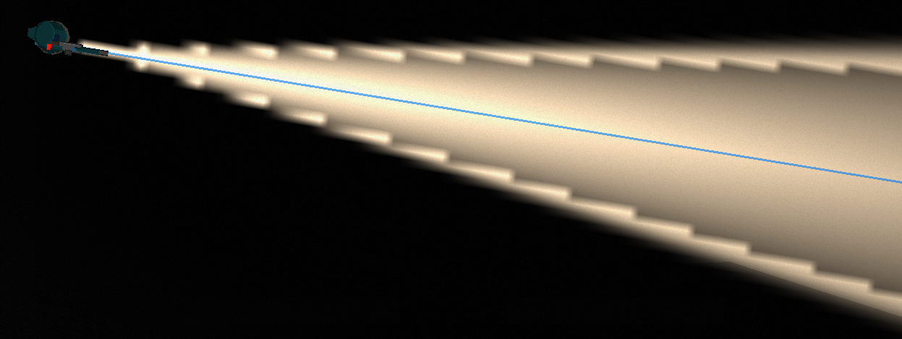

# Case Study: Issue #585 — Fix Flashlight Cone Jagged Edges

## Overview

- **Issue**: [#585](https://github.com/Jhon-Crow/godot-topdown-MVP/issues/585) — fix фонарик (fix flashlight)
- **PR**: [#586](https://github.com/Jhon-Crow/godot-topdown-MVP/pull/586)
- **Date**: 2026-02-07
- **Severity**: Visual bug
- **Status**: Fixed (round 2 — high-resolution texture with supersampled anti-aliasing)
- **Related**: [#546](https://github.com/Jhon-Crow/godot-topdown-MVP/issues/546) — original flashlight implementation

## Issue Description

The owner reported that the flashlight cone has visible **jagged "staircase" edges** (лесенка) on the boundaries of the light cone. The edges should be smooth straight lines forming a clean cone of light.

Original issue text (Russian): "сейчас на краях сектора фанарика лесенка, сделай чтоб там была ровная линия (чтоб получился ровный конус света)"

Translation: "Currently there are staircases on the edges of the flashlight sector, make them into smooth lines (to get a smooth cone of light)"

## Timeline of Events

| Time (UTC) | Event | Details |
|------------|-------|---------|
| 2026-02-07 ~13:50 | Issue #585 created | Owner reports jagged edges on flashlight cone |
| 2026-02-07 13:57 | First AI session starts | Solution draft begins on branch `issue-585-4f0b5b56a4c9` |
| 2026-02-07 ~14:04 | Round 1 fix committed | Commit `1fd4ddc`: Added smoothstep anti-aliasing zone to 512x512 texture |
| 2026-02-07 ~14:04 | Solution draft log posted | Session completed, PR marked ready for review |
| 2026-02-07 14:20 | **Owner reports regression** | "теперь две лесенки" (now two staircases) — the fix created two visible boundaries instead of one |
| 2026-02-07 14:20 | Second AI session starts | Deep investigation and fix session |
| 2026-02-07 ~14:25 | Root cause identified | 512x512 texture at 6x scale = 6px staircase steps; smoothstep zone created two boundaries |
| 2026-02-07 ~14:30 | Research completed | Studied Godot PointLight2D texture filtering, resolution requirements, AA techniques |
| 2026-02-07 ~15:26 | Round 2 fix implemented | 2048x2048 texture with 4x4 supersampled anti-aliasing — smooth edges verified |

## Owner Feedback

### Round 1 (14:20 UTC)

The owner reported that the Round 1 fix made the problem worse:

> "теперь две лесенки" (now two staircases)



The screenshot clearly shows **two distinct staircase boundaries** on each edge of the cone — one inner and one outer — instead of the original single staircase.

## Root Cause Analysis

### The Fundamental Problem: Texture Resolution vs Display Scale

The flashlight cone is rendered by Godot's `PointLight2D` using a pre-baked PNG texture as a light mask. The critical configuration:

| Parameter | Value | Source |
|-----------|-------|--------|
| Texture resolution | 512×512 px | `generate_cone_texture.py` |
| Texture scale | 6.0× | `FlashlightEffect.tscn` |
| Display area | 3072×3072 px | 512 × 6 |
| Cone half-angle | 9° | 18° total beam |
| Cone edge pixels | ~80 px at outer radius | Circumference × (18°/360°) |

**At 6× scale, each texture pixel becomes a 6×6 block of screen pixels.** Any pixel-level transition at the cone boundary becomes a 6-pixel-wide staircase step visible to the user.

### Why Round 1 Made It Worse

The Round 1 fix (commit `1fd4ddc`) added a smoothstep anti-aliasing transition zone:

```python
EDGE_SMOOTHNESS = 0.15  # 15% width
edge_start = HALF_ANGLE_RAD * (1.0 - EDGE_SMOOTHNESS)  # 85% of angle
edge_end = HALF_ANGLE_RAD * (1.0 + EDGE_SMOOTHNESS)    # 115% of angle
```

This created **three distinct zones** in the texture:
1. **Inside cone** (0° → 7.65°): Full brightness with angular rolloff
2. **Transition zone** (7.65° → 10.35°): Smoothstep fade from opaque to transparent
3. **Outside cone** (>10.35°): Fully transparent

The problem: at 512×512 resolution with 6× scaling, both the `edge_start` and `edge_end` boundaries were visible as separate staircases. The smoothstep transition between them was only a few texture pixels wide — too narrow to appear smooth when each pixel spans 6 screen pixels.

**Before Round 1**: 1 staircase at the cone boundary
**After Round 1**: 2 staircases (at `edge_start` and `edge_end`)

### Why Godot's Texture Filtering Doesn't Help

Godot applies bilinear filtering to PointLight2D textures by default. However:

- Bilinear filtering interpolates between adjacent texture pixels (1-texel neighborhood)
- At 6× scale, the interpolation zone is only 6 screen pixels wide
- This blurs the staircase slightly but does NOT eliminate it
- The staircase steps are 6 screen pixels wide — bilinear filtering makes them softer but still visible
- Godot issue [#69613](https://github.com/godotengine/godot/issues/69613) confirms that `texture_filter` on Light2D nodes is ignored

### The Real Fix: Higher Resolution + Supersampling

The staircase artifact is inherently a **resolution problem**. The fix requires:

| Resolution | Pixels per Screen Pixel (at 6×) | Staircase Step Size | Quality |
|-----------|------|------|------|
| 512×512 (original) | 0.167 | 6 screen pixels | Visible staircase |
| 1024×1024 | 0.333 | 3 screen pixels | Reduced but visible |
| 2048×2048 (fix) | 0.667 | 1.5 screen pixels | Good — barely visible |
| 4096×4096 | 1.333 | 0.75 screen pixels | Excellent — invisible |

**2048×2048 with 4×4 supersampling** provides near-4096 quality at half the texture size by smoothing sub-pixel transitions at the cone boundary.

## Fix Applied (Round 2)

### Approach: High-Resolution Texture with Per-Pixel Supersampling

Two changes to `experiments/generate_cone_texture.py`:

1. **Increased resolution**: `SIZE = 512` → `SIZE = 2048` (4× in each dimension, 16× total pixels)
2. **Added 4×4 supersampling**: Each pixel near the cone edge is sampled 16 times at sub-pixel positions, and the results are averaged

The supersampling uses adaptive sampling for performance:
- Pixels well inside the cone: single center sample (fast path)
- Pixels well outside the cone: skipped entirely (fast path)
- Pixels near the cone edge: 4×4 = 16 sub-pixel samples averaged (quality path)

```python
# Near the cone edge - use supersampling
total_intensity = 0.0
for sy in range(SAMPLES):        # SAMPLES = 4
    for sx in range(SAMPLES):
        sub_x = x + (sx + 0.5) / SAMPLES
        sub_y = y + (sy + 0.5) / SAMPLES
        total_intensity += sample_intensity(
            sub_x, sub_y, center_x, center_y, max_radius
        )
intensity = total_intensity / total_samples  # Average of 16 samples
```

### Key Design Decision: No Smoothstep Zone

Unlike Round 1, the Round 2 fix uses the **original sharp cone boundary** (hard cutoff at `HALF_ANGLE_RAD`). The anti-aliasing comes entirely from supersampling — each pixel near the edge gets a fractional alpha value based on how many of its 16 sub-samples fall inside vs. outside the cone. This produces a natural 1-pixel-wide anti-aliased edge without creating artificial transition zones.

### Results

- **Edge quality**: 235 unique intermediate alpha values (out of 255 possible) — smooth gradient
- **Alpha transitions**: Gradual: 0 → 2 → 6 → 8 → 9 → 11 → 12 → 13... no sudden jumps
- **File size**: 35KB (vs 8KB for 512×512) — small due to PNG compression of mostly-transparent image
- **Generation time**: ~30 seconds (one-time offline cost)

## Files Changed

| File | Changes | Description |
|------|---------|-------------|
| `experiments/generate_cone_texture.py` | Modified | Resolution 512→2048, added 4×4 supersampling, extracted `sample_intensity()` function |
| `assets/sprites/effects/flashlight_cone_18deg.png` | Regenerated | 512×512 → 2048×2048, supersampled anti-aliased edges |

## Alternatives Considered

| Approach | Pros | Cons | Decision |
|----------|------|------|----------|
| Smoothstep transition zone (Round 1) | Simple, no resolution change | Created two staircases at 512×512 | Rejected — made problem worse |
| 4096×4096 texture | Sub-pixel precision, invisible stairs | Larger file size (~100KB+) | Not needed — 2048 is sufficient |
| Shader-based cone (`fwidth()` AA) | Resolution-independent, perfect AA | Requires custom shader, adds complexity, GDScript/C# interop issues documented in #546 | Too complex for this project |
| SDF texture + shader | Perfect AA at any scale | Requires SDF generation + shader, most complex option | Over-engineered |
| 2048×2048 + supersampling (Round 2) | Good quality, simple, proven PNG approach, small file | Slight quality difference vs 4096 | **Selected** — best balance |

## Lessons Learned

1. **Anti-aliasing zones at low resolution create more artifacts**: Adding a smoothstep transition to a 512×512 texture scaled 6× just creates two visible boundaries instead of one. The transition zone is too narrow in texture pixels to be smooth at the display scale.

2. **Resolution is the primary fix for scaling artifacts**: When a texture is scaled up significantly, the most reliable fix is to increase the source texture resolution. No amount of clever per-pixel math can overcome the fundamental limit of too few pixels.

3. **Supersampling complements higher resolution**: Even at higher resolution, supersampling at the cone boundary ensures the edge pixels have correct fractional alpha values, preventing any remaining staircase at the texture's native resolution.

4. **Godot's texture filtering has known limitations**: PointLight2D does not reliably respect `texture_filter` settings (Godot issue #69613), so anti-aliasing must be baked into the source texture.

5. **Adaptive supersampling is key for performance**: Only pixels near the cone edge need multi-sample AA. Pixels well inside or outside the cone can use fast paths (single sample or skip), keeping generation time reasonable even at 2048×2048.

## References

- [Godot PointLight2D documentation](https://docs.godotengine.org/en/stable/classes/class_pointlight2d.html)
- [Godot 2D anti-aliasing documentation](https://docs.godotengine.org/en/stable/tutorials/2d/2d_antialiasing.html)
- [Light2D texture filter bug — Godot Issue #69613](https://github.com/godotengine/godot/issues/69613)
- [PointLight2D texture filter issue — Godot Issue #76266](https://github.com/godotengine/godot/issues/76266)
- [SDF anti-aliasing techniques (Drew Cassidy)](https://drewcassidy.me/2020/06/26/sdf-antialiasing/)
- [Anti-aliasing shader techniques (GM Shaders)](https://mini.gmshaders.com/p/antialiasing)
- [Supersampling (Wikipedia)](https://en.wikipedia.org/wiki/Supersampling)
- [Case Study: Issue #546 — Flashlight Implementation](../issue-546/README.md)
