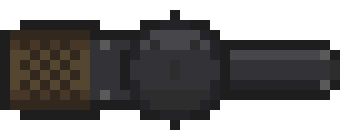
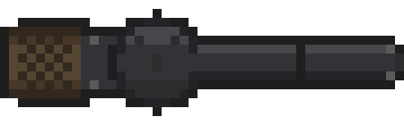
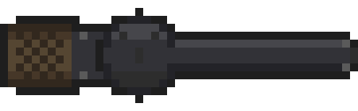

# Case Study: Issue #646 — Extending Revolver Barrel Sprite to 2x Length

## Overview

| Field | Value |
|-------|-------|
| **Issue** | [#646](https://github.com/Jhon-Crow/godot-topdown-MVP/issues/646) — "fix модель револьвера" |
| **Pull Request** | [#647](https://github.com/Jhon-Crow/godot-topdown-MVP/pull/647) |
| **Repository** | [Jhon-Crow/godot-topdown-MVP](https://github.com/Jhon-Crow/godot-topdown-MVP) |
| **Date** | 2026-02-08 |
| **Weapon** | RSh-12 assault revolver (12.7x55mm) |
| **Original Sprite** | `revolver_topdown.png` — 34x14 pixels |
| **Target Sprite** | `revolver_topdown.png` — 45x14 pixels (+11px barrel extension) |

## Issue Description

The repository owner requested (in Russian): *"сделай ствол револьвера в 2 раза длиннее"* — "Make the revolver barrel 2 times longer."

The RSh-12 is a real Russian assault revolver with a 150mm barrel, notable for firing from the bottom chamber of its cylinder. In the game's topdown sprite, the barrel section spans approximately 11 pixels (x=22 to x=33), so doubling it required adding 11 more pixels of barrel.

## Timeline of Events

### Session 1: Initial Barrel Extension (12:38–12:45 UTC)

1. **12:38:06** — Issue #646 created by Jhon-Crow
2. **12:38:29** — AI solver picks up the issue, creates branch and draft PR #647
3. **12:39–12:40** — AI analyzes the sprite structure using the original creation script (`experiments/create_revolver_sprites.py`)
4. **12:40:40** — Creates `experiments/extend_revolver_barrel.py` using a **split-and-shift** approach:
   - Split sprite at x=22 (barrel start)
   - Shift everything at x>=22 rightward by 11 pixels
   - Fill the 11px gap with flat barrel-colored pixels
5. **12:40:49** — Script produces 45x14 sprite successfully
6. **12:41:30** — Commit `b7839a54`: both topdown and icon sprites extended
7. **Cost**: ~$1.20–$1.65 USD

**Result**: Barrel successfully doubled, but with a **visible seam** (vertical dark line) at the join point, and the icon sprite was unnecessarily modified.

### Session 2: Auto-restart (12:45–12:48 UTC)

Triggered by leftover uncommitted files from session 1. Cleaned up `issue-details.txt` and `pr-details.txt`. **Cost**: ~$0.63–$0.66 USD.

### Owner Feedback #1 (13:00 UTC)

Jhon-Crow reviewed and provided feedback:
1. *"убери стык в месте продления ствола"* — Remove the seam at the barrel extension point
2. *"верни предыдущий значок в armory"* — Revert the icon to original (without extended barrel)

### Session 3: Seam Fix Attempts (13:01–13:05 UTC)

Three fix scripts were created in rapid succession (~3 minutes):

| Version | Script | Approach | Outcome |
|---------|--------|----------|---------|
| v1 | `fix_barrel_seam.py` | Nearest-neighbor stretch of original barrel to 2x width | Produced distorted barrel pattern |
| v2 | `fix_barrel_seam_v2.py` | Tile middle barrel pattern, append barrel end | **Crashed** — array size mismatch (`ValueError`) |
| v3 | `fix_barrel_seam_v3.py` | Corrected tiling with proper dimension math | Completed, claimed seamless |

The v3 approach:
- Took a 4px-wide sample from mid-barrel (x=18–22)
- Tiled it ~2.75 times to fill the 11px extension
- Appended the barrel end and front sight

Commit `171c3b77`: "fix: remove barrel seam and revert icon to original"
Commit `4f12cb16`: "chore: add additional barrel seam fix experiments"

**Cost**: ~$0.71–$0.93 USD

### Owner Feedback #2 (13:44 UTC)

Jhon-Crow reviewed again:
- *"значок правильный"* — The icon is correct (good)
- *"верни модель из предыдущего коммита (с двойным стволом), но сотри границу между стволами"* — Return the model from the previous commit (with the double barrel), but erase the boundary between barrels

This revealed that Session 3's v3 fix **changed the barrel appearance too much**. The owner preferred the barrel from the initial extension (commit `b7839a54`) but with the seam simply erased.

### Session 4: Final Fix (current session)

Pixel-level analysis revealed the root cause clearly:

**The seam was a single column (x=33) of outline-colored pixels** (`#1e1e1e` / RGB 30,30,30) running through the barrel body. In the initial extension, the entire barrel section (including the outline at the barrel's end) was copied, creating a visible vertical dark line in the middle of the barrel.

The fix was surgical and minimal — replace 4 pixels at column 33 (rows 5–8) with the correct barrel body colors:

| Row | Seam pixel (before) | Fixed pixel (after) | Description |
|-----|--------------------|--------------------|-------------|
| 4 | `#1e1e1e` (outline) | `#1e1e1e` (kept) | Top outline — already correct |
| 5 | `#1e1e1e` (outline) | `#46464b` (highlight) | Barrel highlight band |
| 6 | `#1e1e1e` (outline) | `#323237` (body) | Barrel body |
| 7 | `#1e1e1e` (outline) | `#323237` (body) | Barrel body |
| 8 | `#1e1e1e` (outline) | `#232328` (shadow) | Barrel bottom shadow |
| 9 | `#1e1e1e` (outline) | `#1e1e1e` (kept) | Bottom outline — already correct |

Script: `experiments/fix_barrel_seam_final.py`

## Visual Comparison

All sprites shown at 10x magnification:

### Original (34x14)


### Extended with seam (45x14) — commit b7839a54


Note the vertical dark line approximately in the middle of the barrel — this is the seam at column 33.

### Fixed seamless barrel (45x14) — final version


The seam at column 33 has been replaced with continuous barrel body colors.

## Root Cause Analysis

### Why the seam appeared

The initial barrel extension script (`extend_revolver_barrel.py`) used a **copy-the-entire-barrel-section** approach. The original barrel section in the sprite runs from x=22 to x=33, where:
- x=22 is the left outline (cylinder-to-barrel transition), pixel color `#1e1e1e`
- x=23–32 are barrel body pixels with various metal colors
- x=33 is the right outline (barrel end / muzzle), pixel color `#1e1e1e`

When this entire section (including the right outline at x=33) was duplicated and appended, the result was:

```
... [barrel body] [right outline] [left outline] [barrel body] ...
                       ↑               ↑
                   Column 33       Column 34
                   (seam = original barrel end outline)
```

This created two adjacent dark outline columns (x=33 and x=22 in the copy, now at x=34) which appear as a visible vertical seam.

However, looking more carefully at the data, column 34 in the initial extend actually starts with barrel body colors, not outline. So the seam is specifically **one column** of outline pixels at x=33 that interrupts the barrel body pattern.

### Why Session 3 fixes were rejected

Session 3 took a fundamentally different approach — instead of fixing the specific seam column, it **regenerated the entire barrel section** using pattern tiling from the original sprite. This:

1. Changed the barrel's pixel pattern from what the owner had already approved
2. Introduced a subtly different visual appearance (different color values at many pixels)
3. The owner specifically asked to keep the barrel from the previous commit and only erase the boundary

### The correct fix

The correct fix was **minimal and surgical**: identify the exact seam column (x=33) and replace only the 4 barrel-body pixels (rows 5–8) with the correct barrel body colors that match their neighboring columns. Rows 4 and 9 (top and bottom outlines) were already correct since the barrel outline runs continuously along those rows.

## Lessons Learned

### 1. Pixel-level analysis before fixing

For pixel art sprites (especially tiny ones like 34x14), a full pixel-level dump and comparison is essential before attempting any fix. The seam was literally a single column of 4 wrong pixels — not a complex pattern-matching problem.

### 2. Minimal changes over regeneration

When the owner says "keep X but fix Y," the fix should modify only Y and leave X untouched. Session 3's approach of regenerating the barrel section was over-engineered and changed approved content.

### 3. Scale matters for verification

Viewing a 45x14 pixel art sprite at native resolution (or even as a base64 PNG in a terminal) is insufficient for quality verification. Magnified comparison (10x or more) is necessary to identify single-pixel issues.

### 4. Understand the copy operation

When extending sprites by copying sections, be aware that the copied section includes its boundary/outline pixels. These outline pixels become seams when placed in the interior of the sprite.

### 5. Cost of iteration

Total estimated cost across all sessions: ~$2.54–$3.24 USD for what ultimately required changing 4 pixels. Early pixel-level analysis would have identified the fix immediately.

## Files

### Logs
- `logs/session-1-initial-solution.txt` — Initial barrel extension session
- `logs/session-2-auto-restart.txt` — Auto-restart cleanup session
- `logs/session-3-feedback-fix.txt` — First seam fix attempt session

### Data
- `issue-data.json` — Issue #646 metadata
- `pr-data.json` — PR #647 metadata
- `pr-comments.json` — PR #647 conversation comments

### Sprites
- `sprites/original_10x.png` — Original barrel at 10x magnification
- `sprites/extended_with_seam_10x.png` — Extended barrel with visible seam at 10x
- `sprites/fixed_seamless_10x.png` — Fixed seamless barrel at 10x

### Experiment Scripts (in repository root)
- `experiments/extend_revolver_barrel.py` — Initial extension script
- `experiments/fix_barrel_seam.py` — Fix v1 (stretch approach)
- `experiments/fix_barrel_seam_v2.py` — Fix v2 (crashed)
- `experiments/fix_barrel_seam_v3.py` — Fix v3 (pattern tiling)
- `experiments/fix_barrel_seam_final.py` — Final fix (4-pixel surgical fix)

## References

- [RSh-12 — Wikipedia](https://en.wikipedia.org/wiki/RSh-12) — The real Russian assault revolver this sprite represents
- [RSh-12 — Modern Firearms](https://modernfirearms.net/en/handguns/double-action-revolvers/russia-double-action-revolvers/rsh-12-2/) — Specifications (150mm barrel length)
