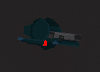
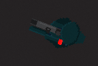

# Case Study: Issue #7 — Arm Separation Bug (Right Shoulder not Attached to Body)

## Overview

**Issue:** After the weapon system refactor (PR #1205 / Issue #7), the player's right arm (shoulder)
appears detached from the body — specifically, it shows up "behind the back" instead of its correct
position at the player's side.

**Reported by:** @Jhon-Crow (repository owner)
**Reported in:** PR #1205 comments, 2026-03-20
**Issue reference:** https://github.com/Jhon-Crow/godot-topdown-MVP/issues/7
**PR reference:** https://github.com/Jhon-Crow/godot-topdown-MVP/pull/1205

---

## Visual Evidence

### Broken State (after PR #1205)
The right arm/shoulder appears disconnected from the body, displaced far to the lower-left ("behind the back"):



### Expected State (before PR #1205)
The right arm/shoulder sits naturally at the player's side:



---

## Timeline / Sequence of Events

1. **Issue #7 opened** — Request to create abstract weapon system (`BaseWeapon.cs`, `AssaultRifle.cs`)
   with laser sight and magazine system.

2. **PR #1205 created** — AI solver refactored the player to use a new arm hierarchy:
   - Renamed `LeftArm` → `RightShoulder` (upper arm)
   - Renamed `RightArm` → `RightForearm`
   - Made `RightForearm` a **child** of `RightShoulder` in the scene tree
   - This was intended to fix PR #449 / Issue #1204 (arm elbow separation during grenade throw)

3. **GDScript (`scripts/characters/player.gd`)** was updated correctly:
   - Only animates `_right_shoulder_sprite` (the shoulder)
   - Never directly moves the forearm (it follows as a child node)
   - `_base_right_arm_pos` is set to `Vector2.ZERO` and never used

4. **C# (`Scripts/Characters/Player.cs`)** was NOT fully updated:
   - `_rightArmSprite` points to `RightShoulder/RightForearm` (the child node)
   - `_baseRightArmPos` is set to `Vector2.Zero` (correct intent — forearm shouldn't be independently animated)
   - BUT `UpdateReloadAnimation()` still animates `_rightArmSprite.Position` using
     `_baseRightArmPos + ReloadArmRightXxx` offsets — all near `(0, 0)` in parent-local space
   - The forearm's correct resting local position is `(-26, 0)` relative to the shoulder
   - Lerping toward `(0, 0)` drags the forearm away from the shoulder joint every time a reload occurs

5. **Bug manifests** — After any reload animation, the forearm's local position gets partially lerped
   toward `(0, 0)`, causing progressive or full detachment from the shoulder.

---

## Root Cause Analysis

### The Core Problem

In `Scripts/Characters/Player.cs`, the `UpdateReloadAnimation()` method:

```csharp
// _rightArmSprite = RightShoulder/RightForearm (child node, local offset (-26, 0))
// _baseRightArmPos = Vector2.Zero  (was set to zero because "forearm follows parent")

rightArmTarget = _baseRightArmPos + ReloadArmRightHold;   // = (0,0) + (0,0) = (0,0)
//   or...
rightArmTarget = _baseRightArmPos + ReloadArmRightBoltPull; // = (0,0) + (-12,-4) = (-12,-4)

// Then lerping the forearm's local position toward this target:
_rightArmSprite.Position = _rightArmSprite.Position.Lerp(rightArmTarget, lerpSpeed);
```

The forearm starts at `(-26, 0)` in parent space (which is the correct elbow position).
When lerped toward `(0, 0)` or `(-12, -4)`, it moves away from the shoulder joint,
causing the visual separation.

### Why The GDScript Version Was Fine

The GDScript player (`scripts/characters/player.gd`) was updated correctly during the same PR:
- Never touches `_right_forearm_sprite.position`
- Only animates `_right_shoulder_sprite.position` (the parent)
- The forearm inherits all position/rotation from the shoulder parent automatically

The C# version was partially updated (correctly set `_baseRightArmPos = Vector2.Zero` and added
comments about "forearm follows parent"), but the actual animation code that moves
`_rightArmSprite.Position` was left untouched.

### Why This Caused "Behind the Back" Appearance

The `ReturnIdle` animation phase sets:
```csharp
rightArmTarget = _baseRightArmPos;  // = (0, 0)
```

After a reload completes, the forearm lerps toward local position `(0, 0)` — which is the
**shoulder sprite's own origin point**. In world space, this places the forearm at the shoulder's
center, which visually appears as the forearm "collapsing" into the shoulder or appearing behind/
inside the body.

---

## Fix

**The fix is minimal**: remove all code that animates `_rightArmSprite.Position` and
`_rightArmSprite.Rotation` in the C# `UpdateReloadAnimation()` method.

Since `_rightArmSprite` (`RightForearm`) is a **child** of `_leftArmSprite` (`RightShoulder`)
in the scene tree, it automatically inherits all position, rotation, and scale transformations
from the shoulder. No separate animation is needed or desired.

The only thing that was still valid to set on `_rightArmSprite` was `ZIndex` (for layering during
reload) — but since `ZIndex` on child nodes is relative to the parent when `z_as_relative = true`
(Godot default), even this is inherited. The `ZIndex` manipulation can be kept on the left arm
(shoulder) only.

### Changed Lines in `Scripts/Characters/Player.cs`

1. Remove `_rightArmSprite.ZIndex = 0` from `SetReloadAnimZIndex()` (lines 4086-4089)
2. Remove `_rightArmSprite.Position`/`Rotation` lerp block from `UpdateReloadAnimation()` (lines 4232-4247)

These changes align the C# behavior with the GDScript behavior and with the intent already
documented in the comments ("forearm follows parent; no separate animation needed").

---

## Prevention

To prevent similar bugs in the future:

1. **Code review** should check that when a node's parent changes (sibling→child), all animation
   code referencing the child is also updated, not just initialization code.

2. **Comment the "why"** at animation call sites, not just at initialization. The initialization
   code had correct comments ("forearm follows parent") but the animation code did not.

3. **Consider removing unused references** — if `_rightArmSprite` should never be animated
   directly, removing it (or making it clear it's read-only) would have prevented this.

---

## Related Issues and PRs

- Issue #1204 / PR #1205: The refactor that introduced this bug (arm hierarchy change)
- Issue #448 / PR #449: Previous arm separation bug (different root cause — lerp divergence)
- Issue #7: The original weapon system refactor request

---

## Logs and Data

- `bug_current.png` — Screenshot showing broken state (arm behind back)
- `bug_expected.png` — Screenshot showing expected state (arm at side)
